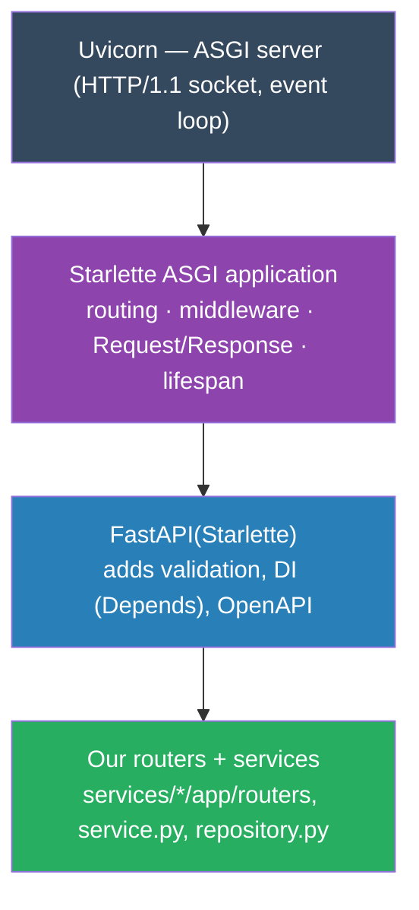
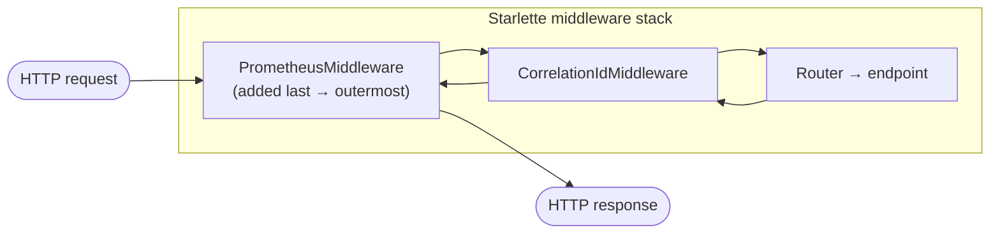
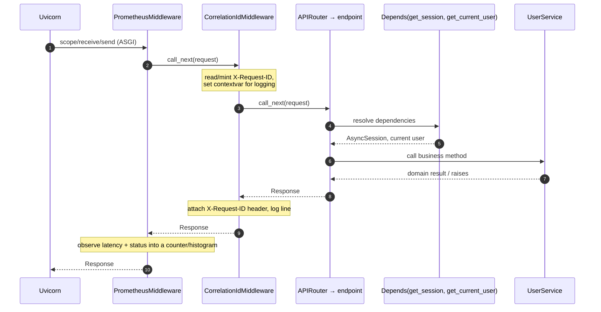
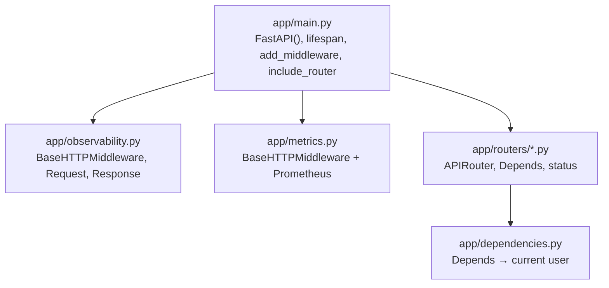

# Starlette in the REST edition — how it works & how this service uses it

> **TL;DR.** FastAPI does not implement HTTP itself — it is a thin, typed layer
> on top of **Starlette**, an ASGI toolkit. Starlette owns the request/response
> objects, the routing table, the middleware stack, and the application
> lifespan. Uvicorn is the ASGI *server* that drives it. This document explains
> the Starlette machinery this repo actually leans on and points at the exact
> files that use each piece.

---

## 1. The layered picture



Every FastAPI object below is really a Starlette object: `FastAPI` subclasses
`starlette.applications.Starlette`, `APIRouter` wraps `starlette.routing.Router`,
and `fastapi.Request`/`Response` are re-exports of the Starlette ones.

---

## 2. ASGI in one breath — why middleware is an "onion"

ASGI defines an app as a coroutine `app(scope, receive, send)`: `scope` describes
the connection, `receive` pulls request events, `send` pushes response events.
**Middleware** is just an ASGI app that wraps another ASGI app, so the installed
middleware form concentric layers a request travels *in* through and a response
travels *out* through — last-added is outermost.



> Order matters: in [services/users/app/main.py](services/users/app/main.py) we
> `add_middleware(CorrelationIdMiddleware)` **then**
> `add_middleware(PrometheusMiddleware)`. Because Starlette applies middleware in
> reverse of registration, Prometheus ends up outermost and therefore times the
> whole call *including* the correlation logging.

---

## 3. The Starlette API surface this repo uses

| Symbol | Where it comes from | What it does | Used in |
| --- | --- | --- | --- |
| `FastAPI(...)` | subclass of `starlette.applications.Starlette` | the ASGI application object | [services/users/app/main.py](services/users/app/main.py) |
| `lifespan=` (async context manager) | Starlette lifespan protocol | run startup/shutdown code once around the server | `main.py` `lifespan()` |
| `app.add_middleware(cls, **opts)` | Starlette | push a middleware layer onto the onion | `main.py` |
| `BaseHTTPMiddleware` + `dispatch()` | `starlette.middleware.base` | write request/response middleware as one coroutine | [services/users/app/observability.py](services/users/app/observability.py), [services/users/app/metrics.py](services/users/app/metrics.py) |
| `Request` | `starlette.requests` | typed access to headers, path, method, body | `observability.py`, `metrics.py` |
| `Response` / `JSONResponse` | `starlette.responses` | build the outgoing response; set headers | `observability.py`, health/metrics routes |
| `app.include_router(router)` | wraps `starlette.routing.Router` | mount a group of routes | `main.py` |
| `APIRouter` | FastAPI over Starlette routing | declare a cohesive set of endpoints | [services/users/app/routers/](services/users/app/routers/) |
| `Depends(...)` | FastAPI DI (resolved per Starlette request) | inject a DB session / the current user | `routers/*.py`, [services/users/app/dependencies.py](services/users/app/dependencies.py) |
| `HTTPException` / `status` | FastAPI/Starlette | short-circuit with a status code | routers, dependencies |

---

## 4. How a request actually flows



### The middleware itself (real shape, trimmed)

`CorrelationIdMiddleware` is a textbook Starlette `BaseHTTPMiddleware`: override
`dispatch`, do work before/after `call_next`, always return a `Response`.

```python
from starlette.middleware.base import BaseHTTPMiddleware
from starlette.requests import Request
from starlette.responses import Response


class CorrelationIdMiddleware(BaseHTTPMiddleware):
    def __init__(self, app, service_name: str) -> None:
        super().__init__(app)
        self._service_name = service_name

    async def dispatch(self, request: Request, call_next) -> Response:
        rid = request.headers.get("x-request-id") or new_id()
        token = request_id_ctx.set(rid)
        try:
            response = await call_next(request)
            response.headers["x-request-id"] = rid
            return response
        finally:
            request_id_ctx.reset(token)
```

See the full version (with structured JSON logging) in
[services/users/app/observability.py](services/users/app/observability.py); the
same pattern powers the Prometheus RED-metrics layer in
[services/users/app/metrics.py](services/users/app/metrics.py).

### Lifespan — startup/shutdown as an async context manager

Starlette calls the `lifespan` callable once: everything before `yield` runs at
startup, everything after at shutdown.

```python
from contextlib import asynccontextmanager

from fastapi import FastAPI


@asynccontextmanager
async def lifespan(app: FastAPI):
    if settings.auto_create_schema:  # dev/test convenience; prod uses Alembic
        await init_models()
    yield
    # shutdown: nothing to clean up here


app = FastAPI(title="Users Service", lifespan=lifespan)
```

### Routing + dependency injection

`APIRouter` groups endpoints; `Depends` resolves per-request collaborators (a DB
session, the authenticated user) before the handler body runs.

```python
from fastapi import APIRouter, Depends, status

router = APIRouter(prefix="/api/users", tags=["users"])


@router.get("/{user_id}", status_code=status.HTTP_200_OK)
async def get_user(user_id: str, session=Depends(get_session)): ...
```

Real routers live under
[services/users/app/routers/](services/users/app/routers/); the auth dependency
is [services/users/app/dependencies.py](services/users/app/dependencies.py).

---

## 5. Where each concept lives (map)



**Key takeaway.** In this service Starlette is responsible for *the edges* of a
request — transport, routing, the middleware onion, and lifespan — while our own
`service.py`/`repository.py` stay framework-free. That separation is why the same
business core is reused unchanged by the gRPC and GraphQL editions.
