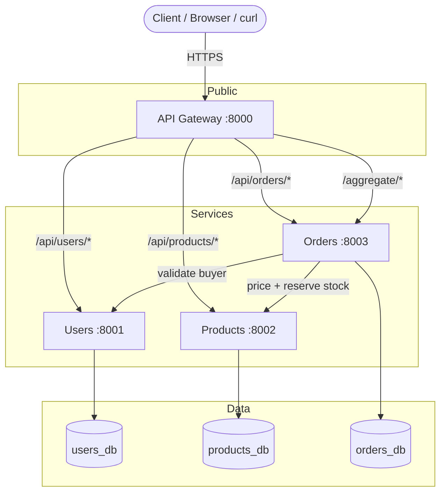
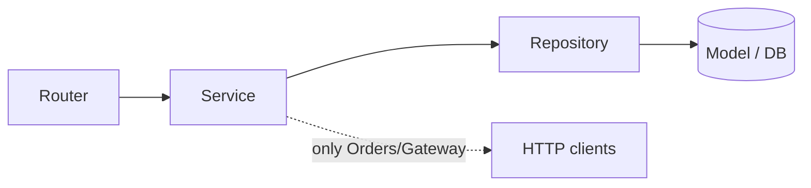

# Architecture — REST E-Commerce

This repository is a small but production-shaped microservices system. It is
built around **four services** that communicate over **REST/JSON** and follow the
**database-per-service** rule.

---

## 1. System topology

**Rules this diagram encodes:**
- The **Gateway is the only public door**. Clients never call services directly.
- Each service owns **its own database**; no service reads another's tables.
- **Orders orchestrates**: it calls Users and Products, but they never call back
  into Orders (no cycles).

---

## 2. Why this shape?

| Decision | Reason |
|----------|--------|
| One service per bounded context | Independent deploys, scaling, and ownership |
| Database-per-service | No shared-schema coupling; services evolve freely |
| Gateway as single entry | One place for auth, rate-limiting, routing, aggregation |
| Orders calls others via HTTP | Explicit contracts; failures are visible & retryable |
| Prices snapshotted in orders | Historical orders stay correct when catalog prices change |
| Money as integer cents | No floating-point rounding errors |
| Correlation id everywhere | One request traceable across every hop |

---

## 3. Internal layering (every service)

- **Router** — HTTP only: parse input, map domain errors to status codes.
- **Service** — business rules; framework-agnostic; raises domain exceptions.
- **Repository** — the only code that runs SQL.
- **Model** — SQLAlchemy 2.0 async tables.
- **Clients** — (Orders & Gateway only) outbound HTTP with timeout + retry.

This separation is what makes each service testable in-process against SQLite,
with downstream services faked — no network, no Docker needed to run the tests.

---

## 4. Technology choices

| Concern | Choice |
|---------|--------|
| Web framework | FastAPI (async, automatic OpenAPI docs) |
| Validation | Pydantic v2 (boundary DTOs) |
| ORM | SQLAlchemy 2.0 async + asyncpg |
| Database | PostgreSQL (one container, three databases) |
| HTTP client | httpx (async) with retry + backoff |
| Passwords | bcrypt (salted, slow) |
| Tokens | JWT (python-jose) |
| Tests | pytest + pytest-asyncio + in-memory SQLite |
| Packaging | Docker + docker-compose |

See [REQUEST-LIFECYCLE.md](REQUEST-LIFECYCLE.md) for a full end-to-end trace of a
checkout request.
