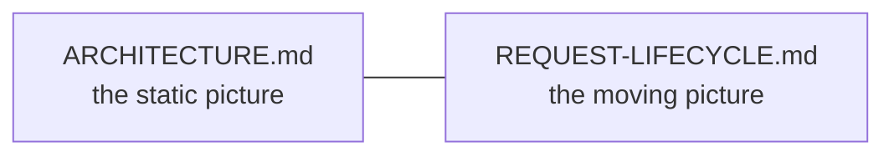
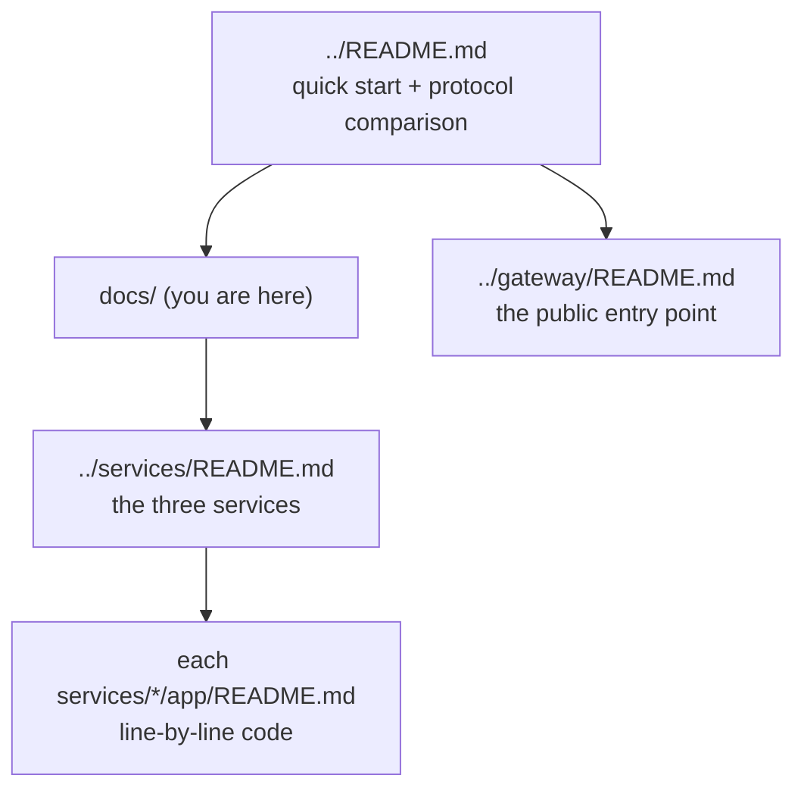

# `docs/` — architecture documentation

System-level documentation for the REST e-commerce repo. These explain the
**whole** system; each folder's own README explains that folder's code.

| Document | Answers |
|----------|---------|
| [ARCHITECTURE.md](ARCHITECTURE.md) | What are the pieces, how do they fit, and why database-per-service? The static structure. |
| [REQUEST-LIFECYCLE.md](REQUEST-LIFECYCLE.md) | What happens, step by step, when a request flows through the system? The dynamic behaviour. |

## Where to go next

- Start with [ARCHITECTURE.md](ARCHITECTURE.md) for the big picture.
- Then [REQUEST-LIFECYCLE.md](REQUEST-LIFECYCLE.md) to see a request move.
- Then drill into [../services/README.md](../services/README.md) and each
  service's `app/` README for the code itself.
