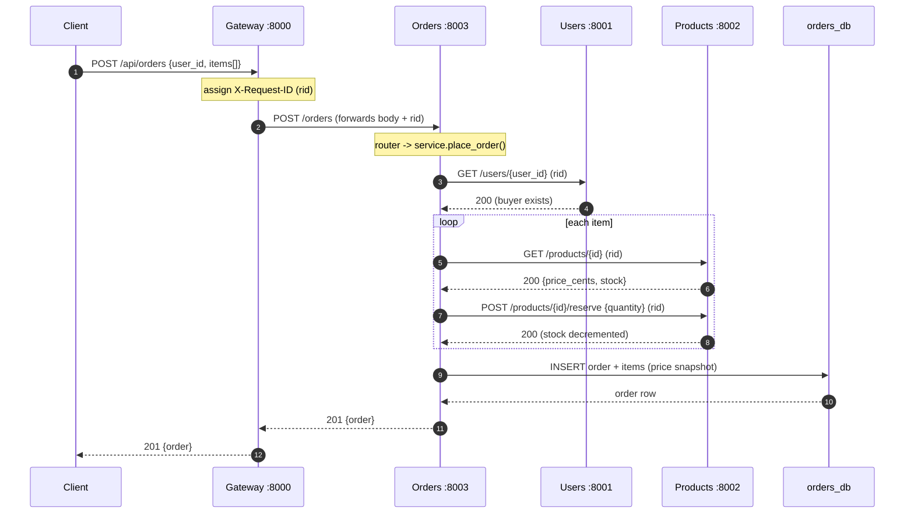
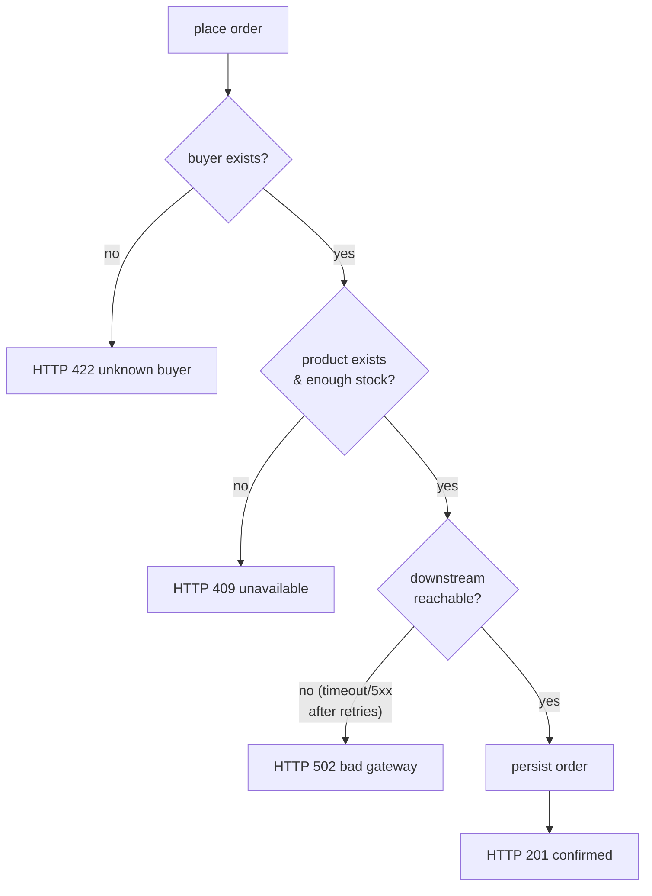

# Request Lifecycle — a checkout, end to end

This traces a single **"place an order"** request through every layer and every
service, so you can see exactly what happens and where things can fail.

---

## 1. The full journey



Every arrow carries the **same `X-Request-ID`**, so searching your logs for that
one id reconstructs this entire diagram.

---

## 2. What each numbered step does

1. Client hits the **gateway** — the only public endpoint.
2. Gateway assigns a correlation id and **forwards** to Orders (it does not
   understand orders; it just routes `/api/orders/*`).
3–4. Orders asks **Users** "does this buyer exist?" A `404` here becomes an
   `HTTP 422` back to the client (bad request — unknown buyer).
5–8. For each line item, Orders asks **Products** for the price, then **reserves**
   the stock. Insufficient stock → `HTTP 409`.
9. Orders writes the order **with a price snapshot** to its own database.
10–11. The confirmed order flows back up through the gateway to the client.

---

## 3. Failure paths



- **Timeouts + retries** live in each caller's HTTP client. Transient failures
  are retried with exponential backoff; a `4xx` is never retried.
- **Partial-failure gotcha:** if stock is reserved but the final INSERT fails,
  that stock is orphaned. The production fix is a **Saga** (compensating
  "release stock" action) or an **outbox** so reserve+persist commit atomically.
  This repo keeps the happy path clear and calls out the gap explicitly.

---

## 4. Observability

Each service logs one structured JSON line per request, including the request id:

```json
{"ts":"...","level":"INFO","logger":"orders","request_id":"7f3a...","message":"POST /orders -> handled in 12.4ms"}
```

Because the id is generated at the gateway and forwarded on every hop, a single
`grep 7f3a` across all four services' logs shows the request's complete path and
timing — the practical payoff of the correlation-id middleware.
