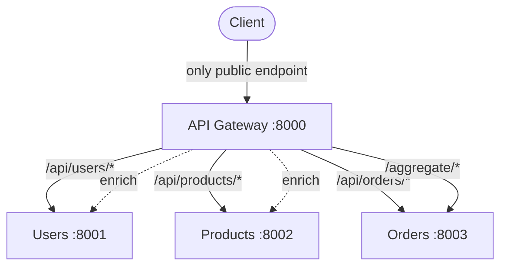
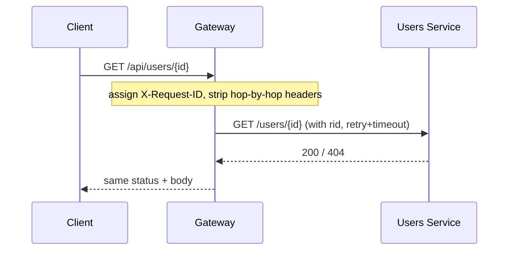
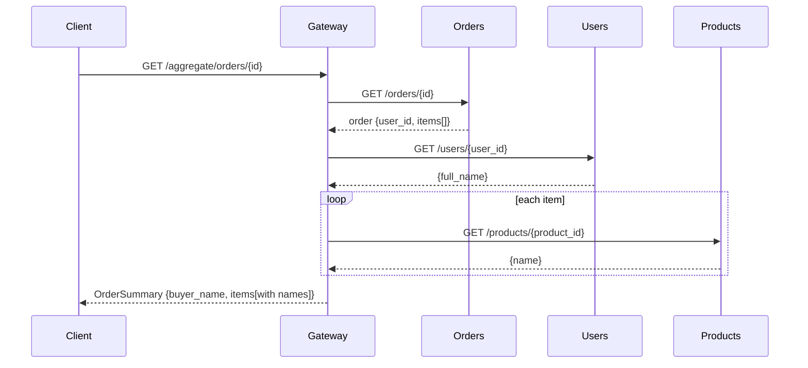
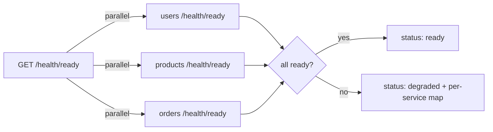

# API Gateway

The **API Gateway** is the single public entry point to the whole system.
Clients only ever talk to the gateway; the gateway talks to the internal
services. It is **stateless** — no database — which makes it trivial to scale
horizontally.

It does three jobs:

1. **Proxy** — forward `/api/users/*`, `/api/products/*`, `/api/orders/*` to the
   matching service.
2. **Aggregate** — combine several services into one response
   (`/aggregate/orders/{id}`), so clients make one call instead of three.
3. **Fan-out health** — report the readiness of every downstream service at once.

---

## 1. Where this service sits



---

## 2. Job 1 — transparent proxying



The forwarding, timeouts, retries, and header propagation all live in one place:
[app/proxy.py](app/proxy.py). Routers stay tiny — see
[app/routers/proxy_routes.py](app/routers/proxy_routes.py).

---

## 3. Job 2 — aggregation (the real value-add)

A plain proxy saves nothing over calling services directly. The gateway earns its
place by **composing** them: `/aggregate/orders/{id}` returns an order already
enriched with the buyer's name and each product's name.



The client made **one** call; the gateway did the fan-out. Implemented in
[app/routers/aggregate.py](app/routers/aggregate.py).

---

## 4. Job 3 — fan-out readiness



The probes run **concurrently** with `asyncio.gather`, so overall latency is that
of the slowest service, not the sum. See [app/routers/health.py](app/routers/health.py).

---

## 5. File-by-file explanation

### `app/proxy.py` — the forwarder
`forward(method, base_url, path, body)` sends the request downstream. It:
- forwards the `X-Request-ID` for tracing,
- applies a timeout and retries transient failures (network / 5xx) with
  exponential backoff,
- returns `502` if the service stays unreachable.

### `app/routers/proxy_routes.py` — pass-through routes
Catch-all routes (`/api/users/{path:path}` etc.) that delegate to `forward`.
Keeping the public paths stable means internal service URLs can change freely.

### `app/routers/aggregate.py` — composition
`GET /aggregate/orders/{id}` fans out to Orders → Users + Products and returns a
single `OrderSummary`. This is the pattern that removes chatty client round-trips.

### `app/routers/health.py` — liveness + fan-out readiness
`/health/live` is always 200 (process up). `/health/ready` probes all three
services in parallel and reports `ready` or `degraded` with a per-service map.

### `app/config.py`, `app/observability.py`, `app/main.py`
Env-driven downstream URLs and HTTP tuning; correlation-id middleware + JSON
logging; app wiring. No database — the gateway holds no state.

> ⚠️ **Gotcha:** a gateway can become a single point of failure and a latency
> multiplier (its own hop + the slowest downstream). Mitigate with multiple
> gateway replicas behind a load balancer, per-route timeouts, and circuit
> breakers so one slow service can't stall the whole gateway.

---

## 6. Running it

```bash
# from gateway/ — needs the three services reachable
pip install -r requirements.txt
uvicorn app.main:app --reload --port 8000
# open http://localhost:8000/docs
```

### Tests
```bash
pytest -q     # downstream services are mocked via httpx.MockTransport
```

The suite covers: liveness, fan-out readiness, user/product proxy pass-through,
forwarded 404, and the enriched order aggregation.
