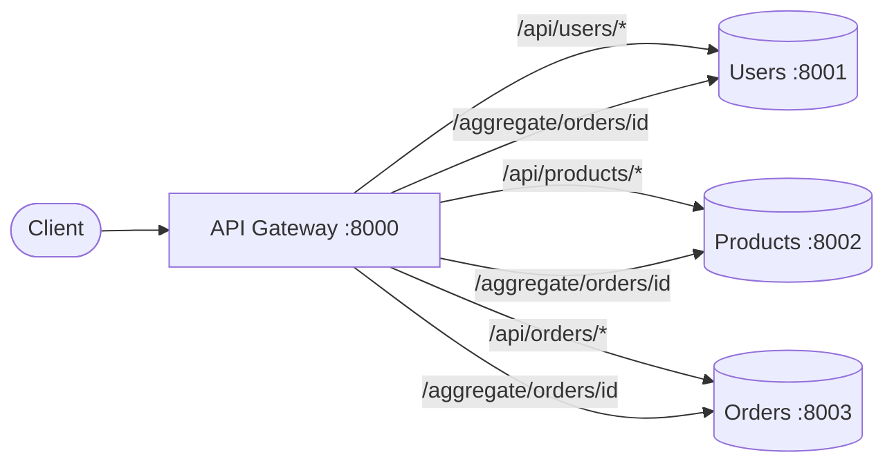
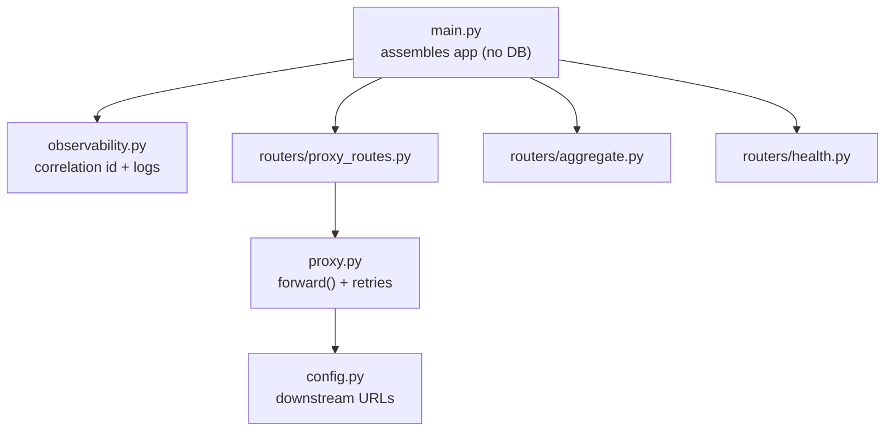
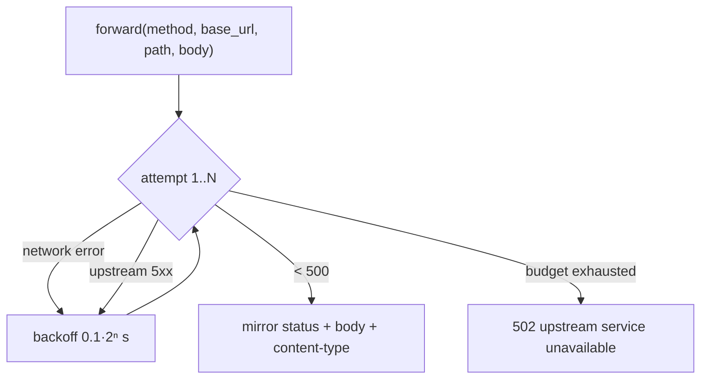
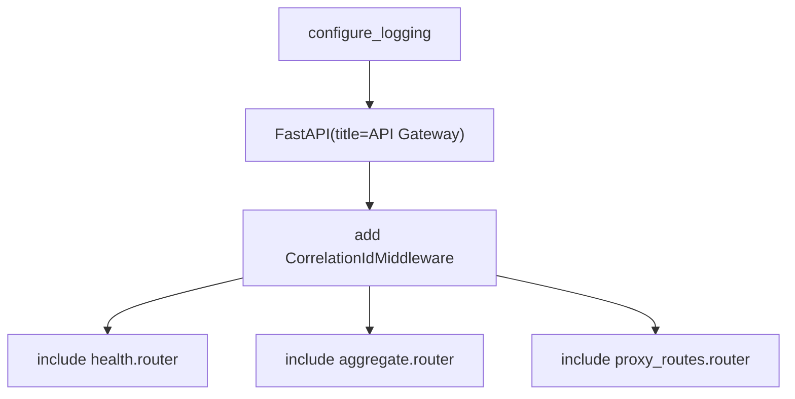

# `gateway/app/` — API Gateway application package

The **API Gateway** is the single public door to the system. It is **stateless**
(no database): it either *proxies* a request straight through to the owning
service, or *aggregates* several services into one response. This folder holds
that logic; the routes live in [`routers/`](routers/README.md).

> **Concepts in this folder** — see [CONCEPTS.md](../../CONCEPTS.md). Illustrates
> the *API Gateway* / *Facade* pattern, *stateless service*, *reverse-proxy with
> retries* (Strategy), and *scatter-gather aggregation* — flagged inline below.

---

## 1. Module map

| File | Role |
|------|------|
| [config.py](config.py) | env settings: `users_service_url`, `products_service_url`, `orders_service_url`, `http_timeout_seconds`, `http_max_retries`. |
| [observability.py](observability.py) | same correlation-id middleware + JSON logging as the services (see [Users §9](../../services/users/app/README.md)). |
| [proxy.py](proxy.py) | the reusable forwarder — timeout, retry, header propagation, hop-by-hop header stripping. |
| [main.py](main.py) | assembles the app and includes the three routers. No `lifespan`/DB. |

---

## 2. `proxy.py` — the reverse-proxy helper

| Detail | Why |
|--------|-----|
| `_SKIP_REQUEST_HEADERS = {host, content-length, connection}` | hop-by-hop headers must not be forwarded verbatim. |
| forwards `X-Request-ID` | keeps one client request traceable across every hop. |
| retries network errors + `5xx` only | transient failures get a few backoff retries; `4xx` is passed straight back (client's fault). |
| returns a `Response` mirroring upstream | the gateway is transparent — same status, body, and content-type. |
| final fallback | after the retry budget, returns a clean `502` JSON instead of leaking a stack trace. |

> **Pattern — Facade / API Gateway:** one edge hides the three services behind a
> simpler surface. **Pattern — Strategy:** the retry/backoff policy wraps the
> forward call, identical in spirit to the Orders `clients.py` retry
> ([03-design-patterns](../../../../03-design-patterns/architectural_notes.md),
> [04-system-design](../../../../04-system-design/architectural_notes.md)).

---

## 3. `main.py` — assembly (stateless)

Note there is **no `lifespan` and no `init_models`** — the gateway owns no data.
The `/` meta route advertises the available route families. `uvicorn` imports
`app.main:app`.

> **System design — stateless edge:** owning no data means any number of gateway
> instances are interchangeable behind a load balancer (horizontal scale). The
> `/aggregate` route is *scatter-gather* — fan out to several services, join into
> one response ([04-system-design](../../../../04-system-design/architectural_notes.md)).
