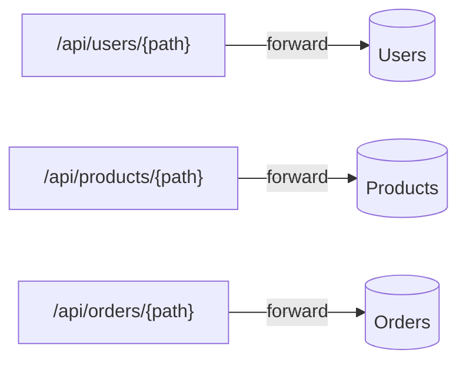
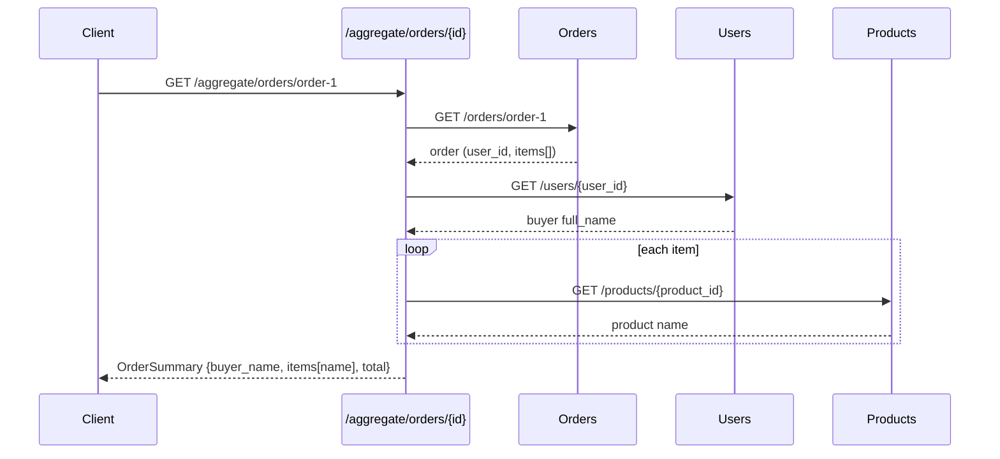
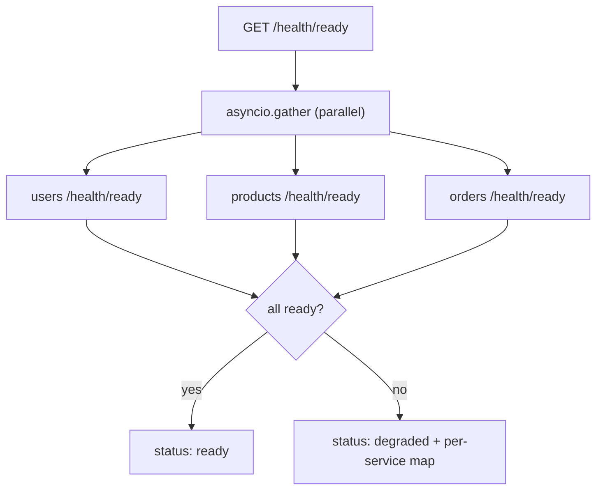

# `gateway/app/routers/` — gateway route families

Three routers, three responsibilities. Together they show the two things a
gateway does beyond being a network hop: **proxying** (stable public URLs) and
**aggregation** (fan-out + combine).

| File | Prefix | Responsibility |
|------|--------|----------------|
| [proxy_routes.py](proxy_routes.py) | `/api` | pass-through to the owning service |
| [aggregate.py](aggregate.py) | `/aggregate` | fan out to several services and merge |
| [health.py](health.py) | `/health` | liveness + fan-out readiness |

---

## 1. `proxy_routes.py` — transparent pass-through

Each catch-all uses `api_route(..., methods=[GET,POST,PUT,DELETE])` with a
`{path:path}` wildcard, reads the raw body, and delegates to `proxy.forward()`.
The public URL (`/api/products/...`) stays stable even if the internal service
address changes — clients never learn the topology.

---

## 2. `aggregate.py` — the value-add endpoint

`GET /aggregate/orders/{id}` returns an order **enriched** with the buyer's name
and each product's name, so the client makes **one** call instead of many.

- Response is shaped by `OrderSummary` / `OrderSummaryItem` Pydantic models.
- Enrichment is **best-effort**: if Users or Products returns non-200, the name
  is left `None` rather than failing the whole request.
- This is exactly the endpoint that GraphQL replaces with on-demand field
  resolvers — a useful cross-protocol comparison point.

---

## 3. `health.py` — fan-out readiness

| Endpoint | Behaviour |
|----------|-----------|
| `/health/live` | process up, returns `{status: alive}` (no network) |
| `/health/ready` | probes all three services **in parallel** (`asyncio.gather`, 2s timeout); overall `ready` only if every service is `ready`, else `degraded` with a per-service breakdown (`ready` / `not-ready` / `unreachable`) |

## 4. `__init__.py`

Empty package marker for `from .routers import aggregate, health, proxy_routes`.
