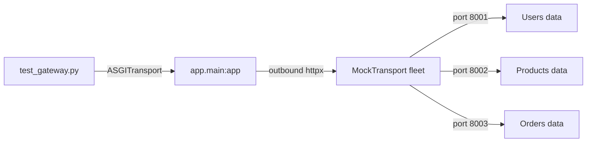
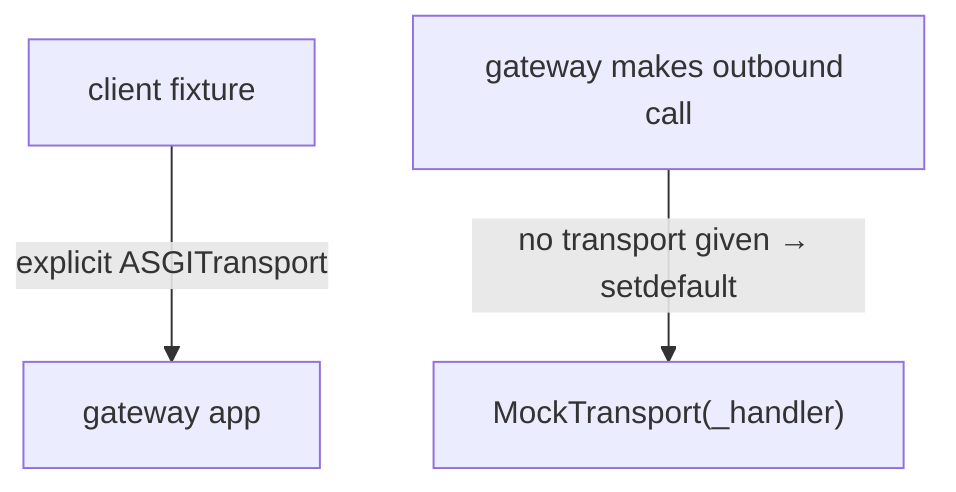
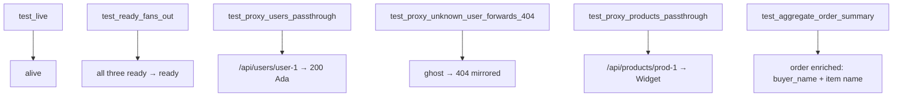

# `gateway/tests/` — test suite

The gateway has **no database** — it only makes outbound HTTP calls. So the test
harness is different from the services: instead of an in-memory DB, it installs
an in-memory **fleet of the three downstream services** and routes the gateway's
outbound calls to them by port.



---

## 1. `conftest.py` — two transports, one trick

The subtlety: the client that calls the **gateway** must use the real ASGI
transport, while every client the **gateway itself** creates must use the mock
fleet. This is solved by monkeypatching `httpx.AsyncClient.__init__`:

```python
def patched_init(self, *args, **kwargs):
    kwargs.setdefault("transport", httpx.MockTransport(_handler))  # default only
    original_init(self, *args, **kwargs)
```



- `setdefault` means an **explicit** transport (the test's `ASGITransport`) is
  respected, while the gateway's own `AsyncClient()` calls fall through to the
  mock fleet.
- `_handler(request)` routes by `request.url.port`: **8001**→USERS, **8002**→
  PRODUCTS, **8003**→ORDERS, and `/health/ready` always returns `ready`.
- The seed data (`USERS`, `PRODUCTS`, `ORDERS` dicts) makes assertions predictable.

---

## 2. `test_gateway.py` — what each test proves



| Test | Asserts | Guards |
|------|---------|--------|
| `test_live` | `{status: alive}` | liveness |
| `test_ready_fans_out` | overall `ready`, all three `ready` | parallel fan-out health |
| `test_proxy_users_passthrough` | `/api/users/user-1` → 200, full name | proxy forwarding |
| `test_proxy_unknown_user_forwards_404` | ghost → **404** | upstream status is mirrored, not swallowed |
| `test_proxy_products_passthrough` | `/api/products/prod-1` → `Widget` | second proxy family |
| `test_aggregate_order_summary` | `buyer_name == Ada`, `items[0].name == Widget`, total | the fan-out + merge |

---

## How to run

```powershell
cd gateway
..\.venv\Scripts\python.exe -m pytest -q
```
