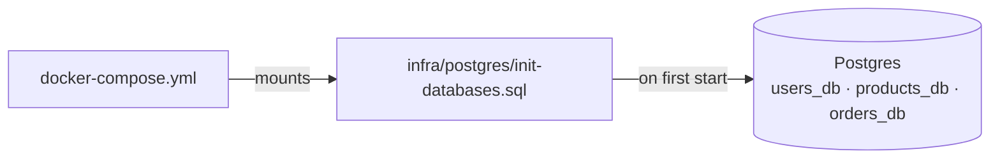

# `infra/` — infrastructure assets

Supporting files that stand up the environment the services run in. There is no
application code here — just the database bootstrap.

| Path | Purpose |
|------|---------|
| [postgres/init-databases.sql](postgres/README.md) | creates the three per-service databases on first Postgres startup |

See [postgres/README.md](postgres/README.md) for the details.
