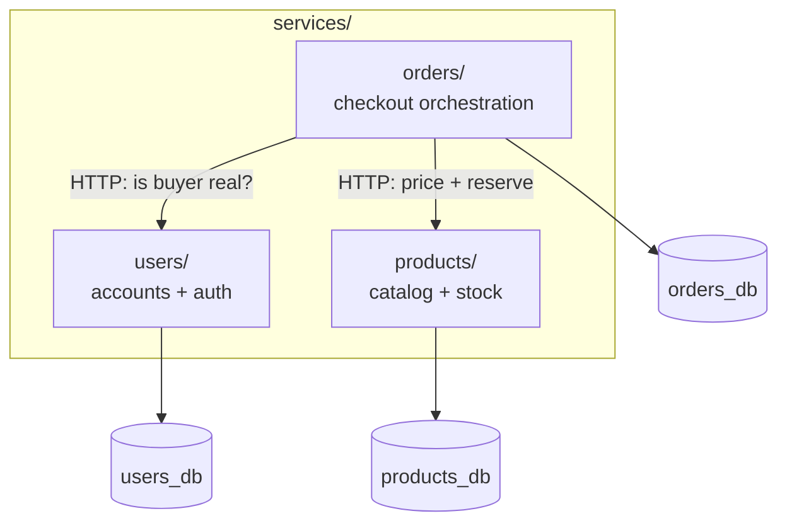
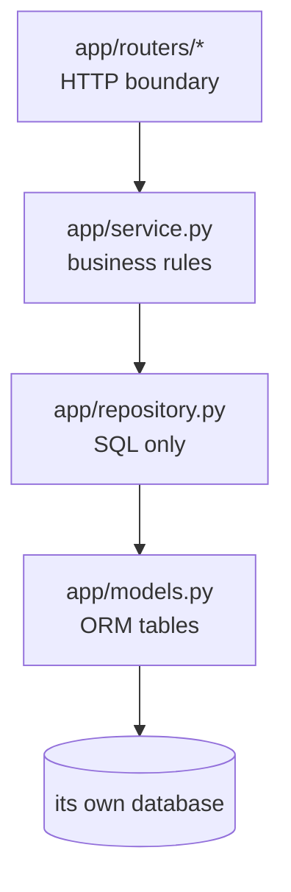

# `services/` — the microservices

This folder holds the three independent backend services. Each is a **separately
deployable unit** with its own code, its own database, its own Dockerfile, and
its own tests. They never share a database or import each other's code — they
communicate only over HTTP.

| Service | Owns | Talks to | README |
|---------|------|----------|--------|
| `users/` | accounts, login/JWT | — (leaf) | [users/README.md](users/README.md) · [app](users/app/README.md) |
| `products/` | catalog, stock reservation | — (leaf) | [products/README.md](products/README.md) · [app](products/app/README.md) |
| `orders/` | orders, checkout flow | Users + Products | [orders/README.md](orders/README.md) · [app](orders/app/README.md) |

---

## The pattern every service follows

- **Database-per-service:** decoupled schemas; a change in one never breaks another.
- **Layered:** each layer has one job and only depends inward — that's what makes
  the services independently testable (each `tests/` folder runs with no network).
- **Same shape, different domain:** learning one service teaches you all three.

Drill into any service's `app/` README for the line-by-line walkthrough.
