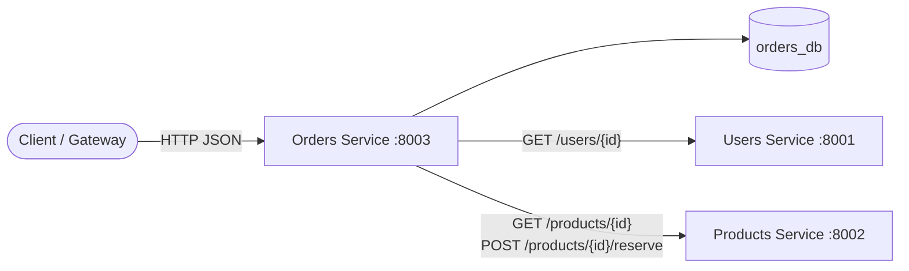
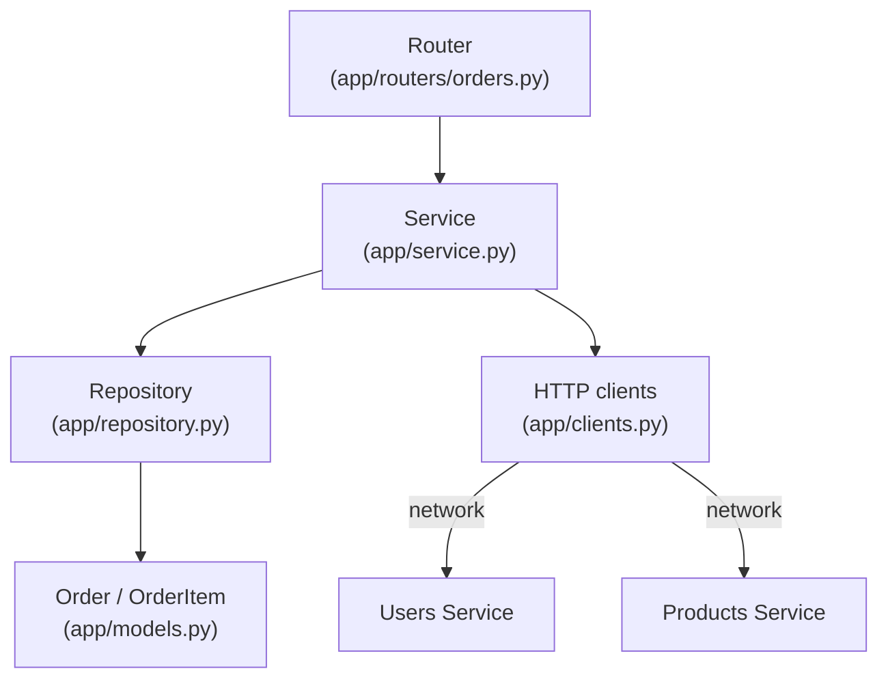
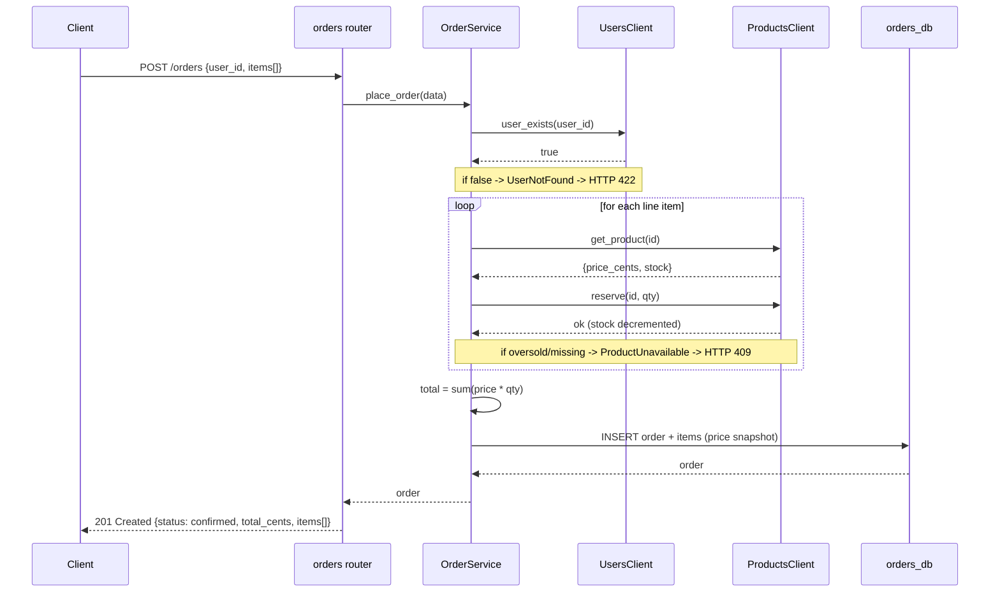
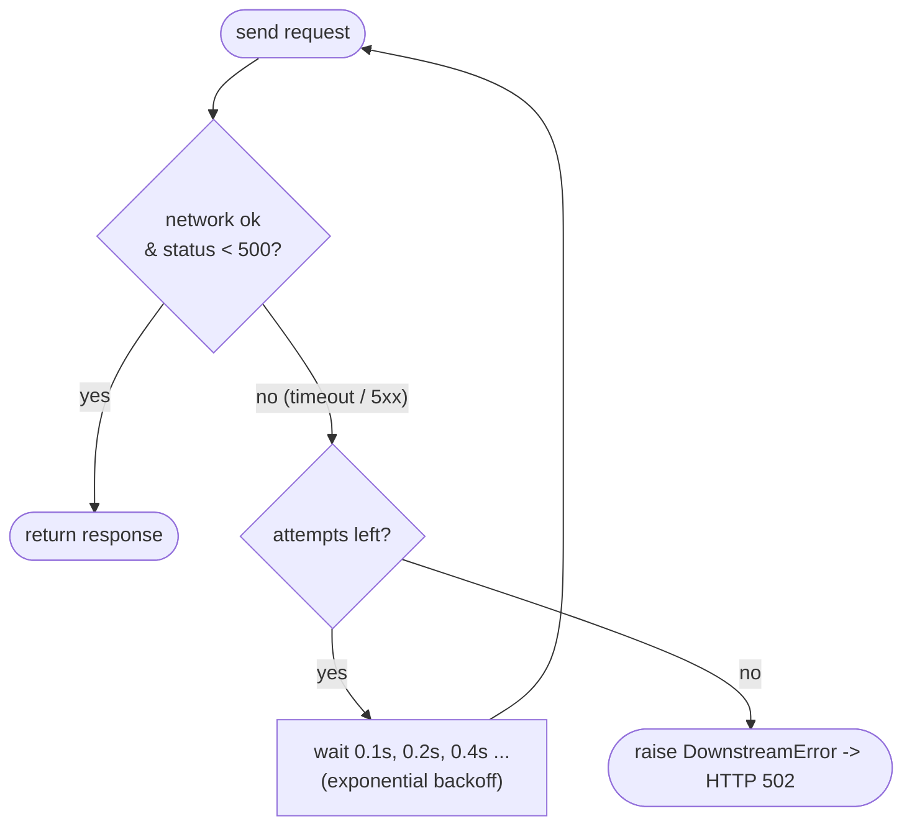

# Orders Service

The **Orders service** is where the system becomes truly *distributed*. Placing
an order is not a single database write — it is an **orchestration** that calls
two other services:

1. **Users service** — confirm the buyer actually exists.
2. **Products service** — get each product's price and reserve its stock.

Only after those succeed does it write the order to its own database
(`orders_db`).

---

## 1. Where this service sits in the system



This is the first service that is a **client** of others. Those calls cross the
network, so they need timeouts and retries (see [clients.py](app/clients.py)).

---

## 2. Layered architecture (with an extra client layer)



The **service layer** now depends on two collaborators (the clients), which is
why they are injected — tests substitute in-memory fakes and run with no network.

---

## 3. The checkout flow — step by step



---

## 4. Resilience: timeouts + retries

Every downstream call goes through `_request_with_retry` in
[clients.py](app/clients.py):



Key rules:
- **Timeout** (`HTTP_TIMEOUT_SECONDS`, default 5s) — never block forever on a
  slow dependency.
- **Retry only transient failures** — network errors and `5xx`. A `4xx` is the
  caller's fault, so it is *not* retried (retrying wouldn't help and could
  duplicate work).
- **Exponential backoff** — spacing retries out avoids hammering a struggling
  service.
- **Correlation id forwarded** — the `X-Request-ID` header is passed downstream
  so one id traces the whole request across all three services.

---

## 5. File-by-file explanation

### `app/models.py` — `orders` + `order_items`
- An `Order` header row has many `OrderItem` rows (`relationship` with
  `cascade="all, delete-orphan"` and `lazy="selectin"` so items are eager-loaded
  in one extra query rather than one-per-row).
- **`unit_price_cents` is a price *snapshot*** taken at purchase time. If the
  catalog price changes tomorrow, past orders keep the price the customer
  actually paid.

### `app/schemas.py` — DTOs
- `OrderCreate` requires at least one item (`min_length=1`) and each item needs
  `quantity > 0`.
- `OrderOut` includes the nested `items` list.

### `app/clients.py` — the network boundary
- `UsersClient.user_exists` — `GET /users/{id}`; 404 → `False`, 200 → `True`.
- `ProductsClient.get_product` / `reserve` — fetch price, then decrement stock.
- Domain exceptions (`UserNotFound`, `ProductUnavailable`, `DownstreamError`)
  translate downstream HTTP outcomes into meaningful errors for the service.

### `app/service.py` — the orchestration
`place_order` runs the three steps (validate buyer → reserve each item → persist)
and raises clear domain errors. Because the clients are injected, this whole flow
is unit-testable with fakes.

### `app/dependencies.py` — injectable clients
Exposes `get_users_client` / `get_products_client` as FastAPI dependencies. Tests
override them with in-memory fakes via `app.dependency_overrides`.

### `app/routers/orders.py` — HTTP endpoints
Maps domain errors to status codes:
`UserNotFound → 422`, `ProductUnavailable → 409`, `DownstreamError → 502`,
unknown order → `404`.

### `app/routers/health.py`, `app/observability.py`, `app/config.py`, `app/database.py`, `app/main.py`
Same patterns as the other services. `config.py` additionally holds the
downstream service URLs and the HTTP timeout/retry settings.

> ⚠️ **Distributed-transaction gotcha:** if the order INSERT fails *after* stock
> was reserved, that stock is now reserved for an order that doesn't exist. A
> real system fixes this with the **Saga pattern** — emit a compensating
> "release stock" action on failure — or an **outbox** so the reserve+order
> commit atomically. This demo keeps the happy path clear; the compensation is
> the natural next step.

---

## 6. Running it

```bash
# from services/orders — needs Users(:8001) and Products(:8002) reachable
pip install -r requirements.txt
uvicorn app.main:app --reload --port 8003
# open http://localhost:8003/docs
```

### Try it with curl (via docker-compose, all services up)
```bash
curl -s -X POST localhost:8003/orders \
  -H 'Content-Type: application/json' \
  -d '{"user_id":"<real-user-id>","items":[{"product_id":"<real-product-id>","quantity":2}]}'
```

### Tests
```bash
pytest -q     # downstream services are faked; no network needed
```

The suite covers: liveness, happy-path order (with correct total), unknown buyer
(422), insufficient stock (409), unknown product (409), get/list orders, unknown
order (404), and empty-items validation (422).
