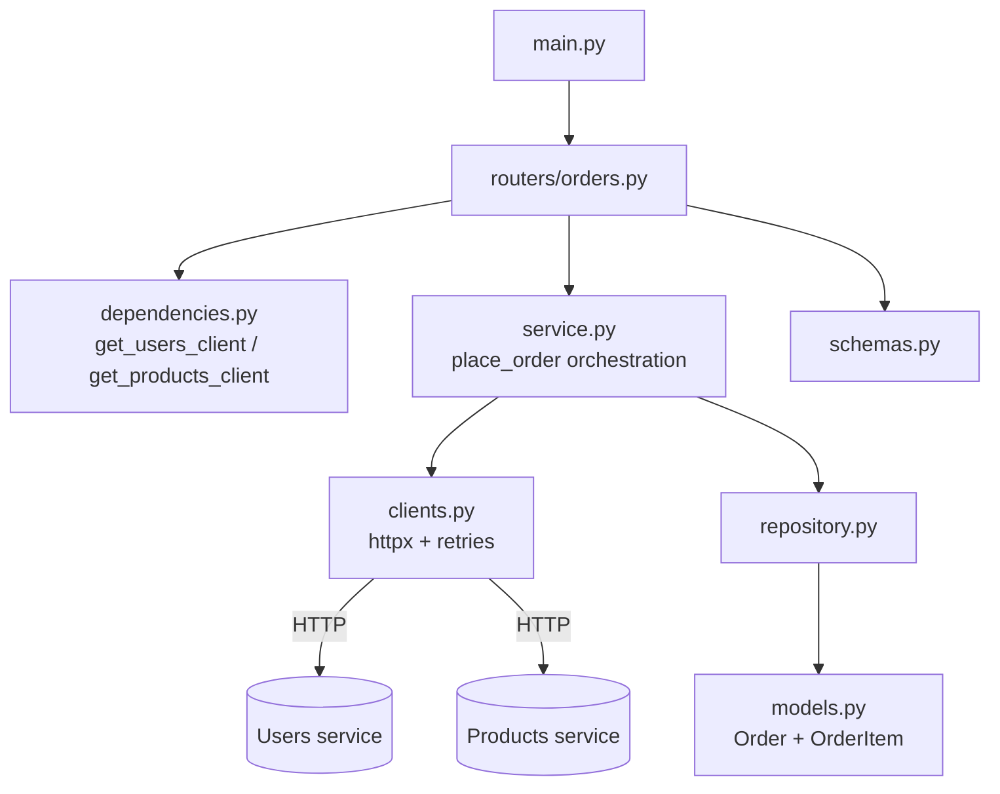
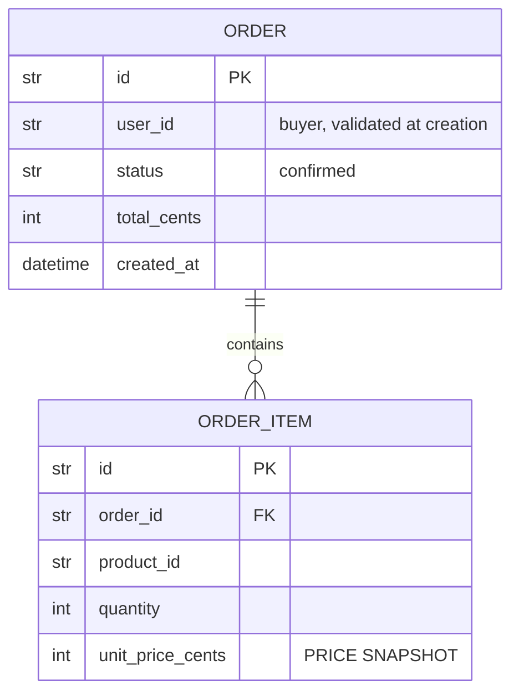
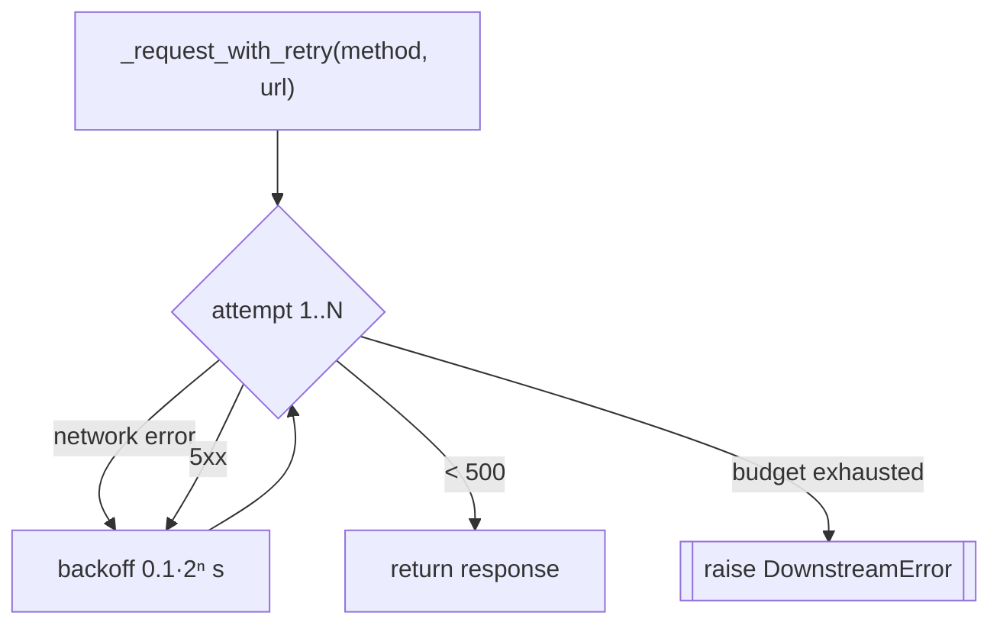

# `services/orders/app/` — application package

The **Orders service** is the orchestrator. Placing an order is a *distributed*
use-case: it validates the buyer against the Users service and prices + reserves
each line against the Products service, then persists the order locally with a
**price snapshot**. This folder adds two modules the other services don't have —
[`clients.py`](clients.py) (outbound HTTP with retries) and
[`dependencies.py`](dependencies.py) (injectable clients).

> Endpoints live in [`routers/`](routers/README.md). Shared infra modules
> (`config.py`, `database.py`, `observability.py`, `main.py`) follow the pattern
> documented in [`../../users/app/README.md`](../../users/app/README.md).

> **Concepts in this folder** — the richest in the repo; see
> [CONCEPTS.md](../../../CONCEPTS.md). Illustrates *Orchestration/Saga*, *Strategy*
> (retry policy), *Dependency Injection*, *Facade* over two clients, and the
> *price-snapshot immutability* system-design pattern — flagged inline below.

---

## 1. Module map



---

## 2. `models.py` — a small aggregate



| Detail | Why |
|--------|-----|
| `Order.items` relationship | `cascade="all, delete-orphan"` (items live/die with the order); `lazy="selectin"` eager-loads items in one extra query so serializing the response never lazy-loads per row. |
| `OrderItem.unit_price_cents` | A **snapshot** of the price at purchase time — later catalog price changes must not rewrite historical orders. |

> **System design — immutability / snapshot:** recording the price *at purchase
> time* (instead of a live lookup) makes an order an immutable historical fact.
> Same idea as event sourcing / ledger entries
> ([04-system-design](../../../../../04-system-design/architectural_notes.md)).

---

## 3. `config.py` — extra downstream settings

Beyond the usual `database_url`, Orders adds:

| Setting | Default | Purpose |
|---------|---------|---------|
| `users_service_url` | `http://localhost:8001` | where to validate buyers (docker-compose overrides with the service name) |
| `products_service_url` | `http://localhost:8002` | where to price + reserve |
| `http_timeout_seconds` | `5.0` | per-request timeout — never wait forever |
| `http_max_retries` | `3` | retry budget for transient failures |

---

## 4. `clients.py` — crossing the network safely

This is the service's outbound edge. It concentrates two production concerns so
the service layer stays clean: **timeouts** and **retries with backoff**.



| Piece | What it does |
|-------|--------------|
| `_headers()` | Forwards `X-Request-ID` (from the contextvar) so the call is traceable across services. |
| `_request_with_retry` | Retries **only** on network errors and `5xx` (server's fault); a `4xx` returns immediately (caller's fault). Backoff is exponential: `0.1, 0.2, 0.4 s`. Exhausting the budget raises `DownstreamError`. |
| `UsersClient.user_exists` | `GET /users/{id}` → `True`/`False` on 200/404, else `DownstreamError`. |
| `ProductsClient.get_product` | `GET /products/{id}` → dict; 404 → `ProductUnavailable`. |
| `ProductsClient.reserve` | `POST /products/{id}/reserve` → dict; **409 → `ProductUnavailable`** (oversold), 404 → `ProductUnavailable`. |

Three domain exceptions are defined here: `DownstreamError` (502-ish),
`UserNotFound`, and `ProductUnavailable` (carries a `.detail` string).

> **Pattern — Strategy:** the retry-with-exponential-backoff logic is an
> interchangeable policy wrapped around the raw HTTP call. **System design —
> resilience:** timeouts + bounded retries + “retry only on 5xx/network” is the
> standard transient-fault-handling recipe
> ([04-system-design](../../../../../04-system-design/architectural_notes.md)).

---

## 5. `dependencies.py` — why the clients are injectable

```python
def get_users_client() -> UsersClient:
    return UsersClient()


def get_products_client() -> ProductsClient:
    return ProductsClient()
```

Declaring the clients as FastAPI dependencies is what lets the test suite call
`app.dependency_overrides[get_users_client] = lambda: FakeUsersClient(...)` and
run the **entire checkout flow with zero network** (see
[`../tests/README.md`](../tests/README.md)).

> **Pattern — Dependency Injection:** the clients are provided to handlers rather
> than constructed inside them, so tests substitute fakes without touching
> business code ([03-design-patterns](../../../../../03-design-patterns/architectural_notes.md)).

---

## 6. `service.py` — the checkout orchestration

```mermaid
sequenceDiagram
    participant R as router
    participant S as OrderService
    participant U as UsersClient
    participant P as ProductsClient
    participant DB as orders_db
    R->>S: place_order(data)
    S->>U: user_exists(user_id)
    U-->>S: True   (else raise UserNotFound → 422)
    loop each line item
        S->>P: get_product(id)   (price)
        S->>P: reserve(id, qty)  (409 → ProductUnavailable)
        S->>S: total += price × qty ; snapshot price
    end
    S->>DB: add(Order + items)
    S-->>R: Order
```

`place_order` steps: **(1)** validate buyer → `UserNotFound`; **(2)** per item,
fetch price + reserve stock, accumulate `total_cents`, snapshot `unit_price_cents`;
**(3)** persist a `confirmed` order. `get` raises `OrderNotFound` when missing.
The module `__all__`-exports `ProductUnavailable` so routers can catch it without
importing `clients` directly.

> **Note (saga/consistency):** if a later line fails after earlier reservations
> succeeded, those reservations are not automatically compensated here — a
> production system would add a compensating "release stock" step or a saga. This
> is called out as a known simplification.

> **Pattern — Orchestration (Saga):** `place_order` is a synchronous orchestrator
> coordinating a multi-service transaction (validate → reserve → persist). The
> missing compensation step above is exactly what a full *Saga* adds
> ([04-system-design](../../../../../04-system-design/architectural_notes.md)).

---

## 7. `repository.py` — SQL only

`add` (INSERT order+items via cascade), `get` (PK fetch), and
`list_for_user` (`WHERE user_id = ? ORDER BY created_at DESC` with pagination).

---

## 8. `schemas.py` — DTOs

| Schema | Rules |
|--------|-------|
| `OrderItemIn` | `product_id` non-empty, `quantity > 0`. |
| `OrderCreate` | `user_id` non-empty, `items` **min_length=1** (an empty order is a 422). |
| `OrderItemOut` / `OrderOut` | `from_attributes=True`; `OrderOut` nests the items and exposes `total_cents` + `status`. |
