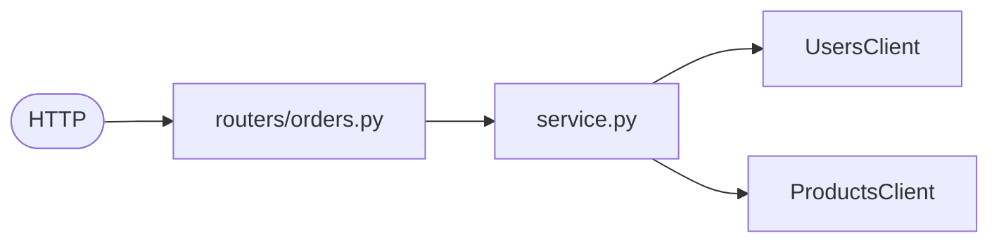
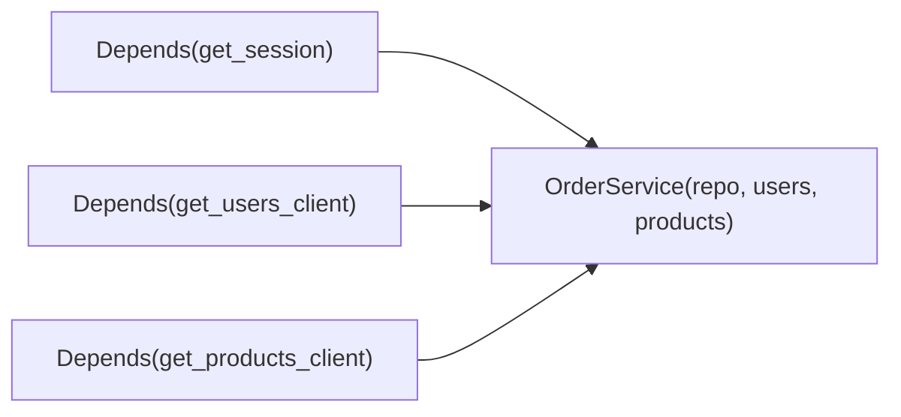
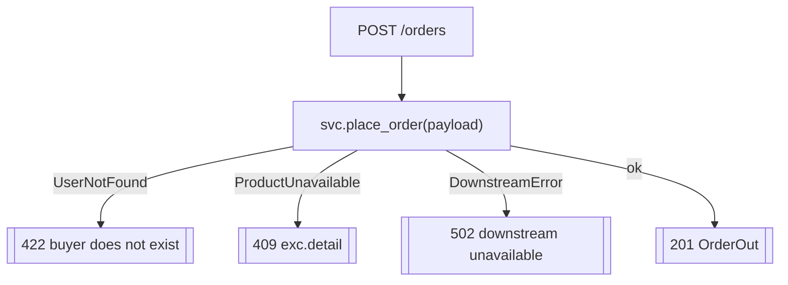

# `services/orders/app/routers/` — HTTP endpoints

The transport layer for orders. The interesting part is that the per-request
dependency assembles **three** collaborators — a DB session and the two
downstream clients — and the `place_order` handler maps *four* different failure
modes to four different HTTP codes.



| File | Prefix | Purpose |
|------|--------|---------|
| [orders.py](orders.py) | `/orders` | place / get / list orders |
| [health.py](health.py) | `/health` | liveness + readiness (same pattern as Users) |

---

## 1. The three-way dependency



```python
def _service(
    session=Depends(get_session),
    users=Depends(get_users_client),
    products=Depends(get_products_client),
) -> OrderService:
    return OrderService(OrderRepository(session), users, products)
```

Because `users`/`products` are dependencies, tests swap them for in-memory fakes.

---

## 2. `place_order` — four failures, four codes



| Exception | HTTP | Meaning |
|-----------|------|---------|
| `UserNotFound` | **422** | the buyer id isn't a real user |
| `ProductUnavailable` | **409** | product missing or not enough stock (detail passed through) |
| `DownstreamError` | **502** | Users/Products unreachable after retries |
| — (success) | **201** | order confirmed |

This explicit mapping is the whole reason the service raises *typed* exceptions
instead of returning error codes — the router is the single translation point.

### Other endpoints

| Handler | Route | Behaviour |
|---------|-------|-----------|
| `get_order` | `GET /orders/{id}` | `OrderNotFound` → **404**, else `OrderOut` |
| `list_orders` | `GET /orders?user_id&limit&offset` | `user_id` is **required** (`Query(..., min_length=1)`); returns that user's orders newest-first |

---

## 3. `health.py`

Same liveness/readiness pattern as the Users service — see
[`../../../users/app/routers/README.md`](../../../users/app/routers/README.md) §2.

## 4. `__init__.py`

Empty package marker for `from .routers import health, orders`.
