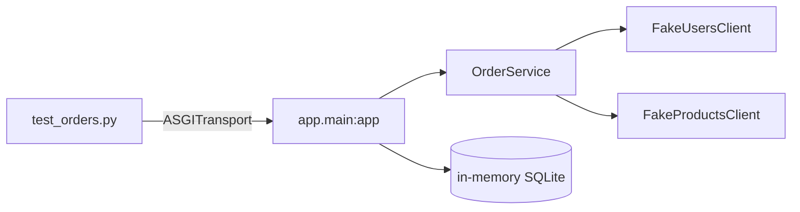
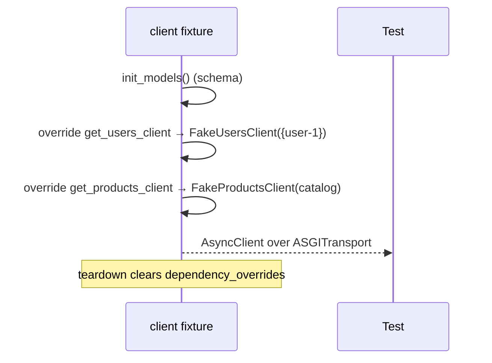
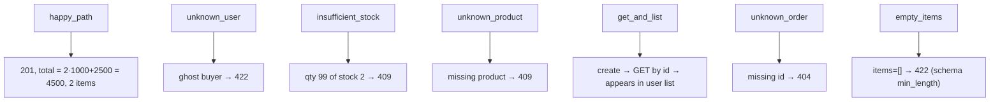

# `services/orders/tests/` — test suite

The Orders service is the only one that calls other services, so its tests are
the most interesting: they replace the two HTTP clients with **in-memory fakes**
via `app.dependency_overrides`, then exercise the full checkout flow with no
network and no other services running.



---

## 1. `conftest.py` — fakes + overrides



| Fake | Behaviour |
|------|-----------|
| `FakeUsersClient(known)` | `user_exists` returns `True` only for ids in the `known` set (`{"user-1"}`). |
| `FakeProductsClient(catalog)` | `get_product` returns price/stock or raises `ProductUnavailable`; `reserve` **mutates** the in-memory catalog stock or raises `ProductUnavailable` when oversold. |

The `catalog` fixture seeds `prod-1` (price 1000, stock 5) and `prod-2`
(price 2500, stock 2), so quantity math in assertions is predictable.

The fakes implement the **same method signatures** as the real clients, so the
service can't tell the difference — this is duck-typed dependency substitution.

---

## 2. `test_orders.py` — what each test proves



| Test | Asserts | Guards |
|------|---------|--------|
| `test_place_order_happy_path` | `201`, `total_cents == 4500`, 2 items | orchestration + price snapshot math |
| `test_place_order_unknown_user_422` | ghost buyer → **422** | buyer validation |
| `test_place_order_insufficient_stock_409` | qty 99 → **409** | oversell protection |
| `test_place_order_unknown_product_409` | missing product → **409** | `ProductUnavailable` mapping |
| `test_get_and_list_orders` | round-trip + appears in user list | read paths |
| `test_get_unknown_order_404` | missing id → **404** | `OrderNotFound` mapping |
| `test_empty_items_rejected_by_validation` | `items=[]` → **422** | boundary validation (`min_length=1`) |

---

## How to run

```powershell
cd services/orders
..\..\.venv\Scripts\python.exe -m pytest -q
```
