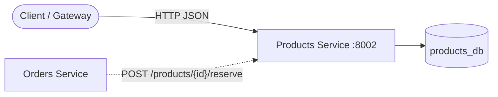
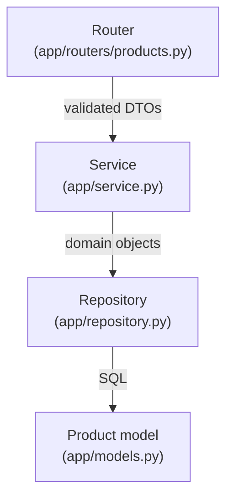
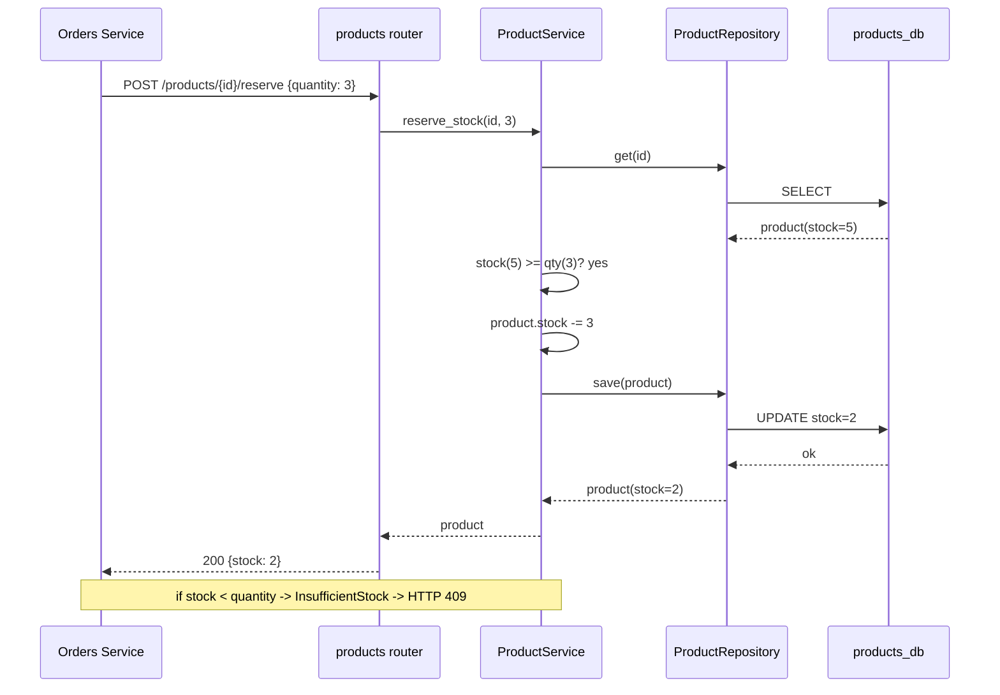

# Products Service

The **Products service** owns the product catalog and inventory: creating
products, looking them up, listing them, and — most importantly — **reserving
stock** when an order is placed. It has its own database (`products_db`) and is
called by the Gateway and by the Orders service.

---

## 1. Where this service sits in the system



- Orders calls `reserve` during checkout to decrement inventory.
- Only this service touches `products_db` (database-per-service).

---

## 2. Layered architecture

Identical layering to every other service — one job per layer.



| Layer | File | Responsibility |
|-------|------|----------------|
| Router | [products.py](app/routers/products.py) | HTTP parsing, error → status code |
| Service | [service.py](app/service.py) | Rules: unique SKU, stock check |
| Repository | [repository.py](app/repository.py) | Queries only |
| Model | [models.py](app/models.py) | `products` table |

---

## 3. The key use-case: reserving stock

This is the endpoint the Orders service depends on. It must never oversell.



---

## 4. File-by-file explanation

### `app/models.py` — the `products` table
- `id` — UUID stored as `String(36)` (works on Postgres and SQLite).
- `sku` — `unique=True, index=True`; the database guarantees no two products
  share a SKU.
- **`price_cents: int`** — money is stored as an integer number of cents, never
  a float. `19.99` becomes `1999`; this avoids binary floating-point rounding
  bugs (`0.1 + 0.2 != 0.3`).
- `stock` — current inventory count.

### `app/schemas.py` — DTOs
- `ProductCreate` — input; `price_cents` and `stock` are constrained `ge=0`.
- `ProductOut` — output (`from_attributes=True` builds it from an ORM row).
- `StockReservation` — `{ "quantity": >0 }`, the body Orders sends to reserve.

### `app/repository.py` — data access
`add`, `get`, `get_by_sku`, `list`, and `save` (for persisting a stock change on
an already-loaded product). Only this file runs SQL.

### `app/service.py` — business rules
- `create` — rejects a duplicate SKU (`SkuAlreadyExists`).
- `get` — raises `ProductNotFound` instead of returning `None`, so callers get a
  clear domain error.
- **`reserve_stock`** — the core rule: if `stock < quantity`, raise
  `InsufficientStock`; otherwise decrement and save. Keeping this here (not in
  the router) means the "never oversell" rule lives in exactly one place.

### `app/routers/products.py` — HTTP endpoints
Thin handlers mapping domain exceptions to status codes:
`SkuAlreadyExists → 409`, `ProductNotFound → 404`, `InsufficientStock → 409`.

### `app/routers/health.py` — liveness/readiness probes
Same as the Users service: `/health/live` (process up) and `/health/ready`
(DB reachable, else 503).

### `app/observability.py`, `app/config.py`, `app/database.py`, `app/main.py`
Same structure as the Users service — correlation-id middleware + JSON logs,
env-driven settings, async engine/session, and app wiring that creates tables on
startup.

> ⚠️ **Concurrency note:** in this demo `reserve_stock` does read-then-write in
> app code. Under heavy concurrent load two requests could both read `stock=1`
> and both decrement. Production would use a conditional UPDATE
> (`UPDATE ... SET stock = stock - :q WHERE id = :id AND stock >= :q`) or
> `SELECT ... FOR UPDATE` so the database enforces the invariant atomically.

---

## 5. Running it

```bash
# from services/products
pip install -r requirements.txt
uvicorn app.main:app --reload --port 8002
# open http://localhost:8002/docs
```

### Try it with curl
```bash
# create a product
curl -s -X POST localhost:8002/products \
  -H 'Content-Type: application/json' \
  -d '{"sku":"TSHIRT-BLK-M","name":"Black T-Shirt (M)","price_cents":1999,"stock":50}'

# reserve 2 units
curl -s -X POST localhost:8002/products/<id>/reserve \
  -H 'Content-Type: application/json' -d '{"quantity":2}'
```

### Tests
```bash
pytest -q
```

The suite covers: liveness, create+get, duplicate-SKU conflict, stock reservation
success, insufficient-stock conflict, reserving an unknown product (404), and
validation rejection of a negative price.
