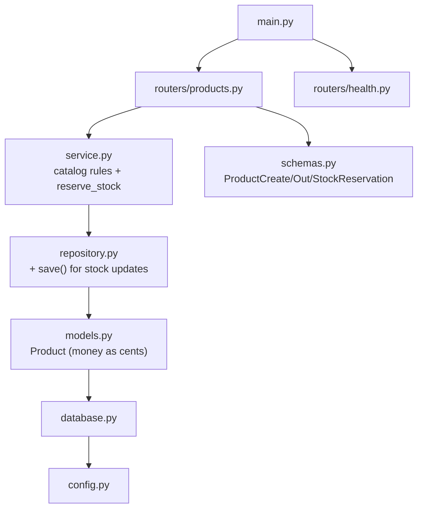
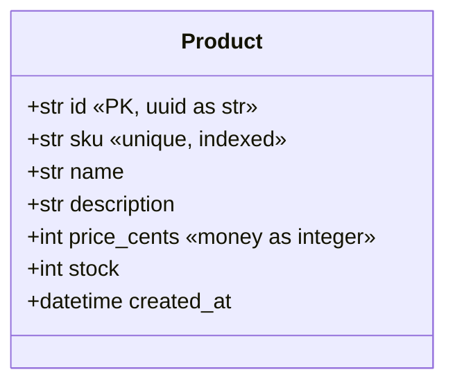
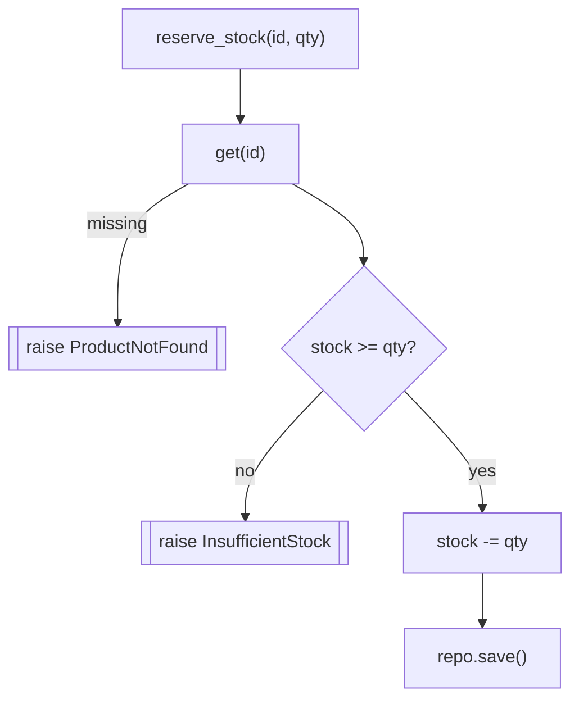

# `services/products/app/` — application package

This folder is the full code of the **Products (catalog) service**. It owns the
`products` table and the one rule that matters at checkout: *you may only reserve
stock that actually exists.* The layering is identical to the Users service, so
this README focuses on what is **different** and links back for the shared parts.

> The HTTP endpoints live in [`routers/`](routers/README.md) (own README). The
> shared infrastructure modules — `config.py`, `database.py`, `observability.py`,
> `main.py` — are byte-for-byte the same pattern documented in
> [`../../users/app/README.md`](../../users/app/README.md) (sections 2, 3, 9, 10).

> **Concepts in this folder** — see [CONCEPTS.md](../../../CONCEPTS.md).
> Illustrates *Repository*, *money-as-integer-cents*, and the
> *check-then-act / oversell* concurrency concern — flagged inline below.

---

## 1. Module map



---

## 2. `models.py` — the `Product` table



| Field | Detail |
|-------|--------|
| `sku` | Human-facing product code; `unique=True, index=True` so lookups and dup-checks are fast and enforced by the DB. |
| `price_cents` | **Money is an integer number of cents**, never a float — this eliminates rounding errors (`$19.99` = `1999`). |
| `stock` | Current on-hand quantity; decremented by reservations. |

> **System design — money as integer cents:** storing currency as an integer
> avoids IEEE-754 float drift in financial arithmetic — a standard money-modelling
> rule ([04-system-design](../../../../../04-system-design/architectural_notes.md)).

---

## 3. `schemas.py` — DTOs with boundary validation

| Schema | Field rules |
|--------|-------------|
| `ProductCreate` | `sku` 1–64 chars, `name` 1–255, `price_cents ≥ 0`, `stock ≥ 0` — enforced by Pydantic before any code runs. |
| `ProductOut` | `from_attributes=True` for ORM→DTO; returns id/sku/name/description/price/stock. |
| `StockReservation` | `quantity > 0` — you cannot reserve zero or negative units. |

---

## 4. `repository.py` — SQL only

Same four methods as Users (`add`, `get`, `get_by_sku`, `list`) **plus one**:

```python
async def save(self, product):     # commit changes to an already-tracked row
    await self._session.commit()
    await self._session.refresh(product)
    return product
```

`save()` exists because `reserve_stock` mutates an object the session already
tracks (it changes `product.stock`) — no `add()` needed, just `commit`.

---

## 5. `service.py` — the reservation rule



| Method | Rule |
|--------|------|
| `create` | reject duplicate `sku` → `SkuAlreadyExists`. |
| `get` | raise `ProductNotFound` instead of returning `None`, so callers get a clear failure. |
| `reserve_stock` | fetch → check `stock >= quantity` → decrement or raise `InsufficientStock`. |

Three domain exceptions (`SkuAlreadyExists`, `ProductNotFound`,
`InsufficientStock`) are defined here and translated to HTTP by the router.

> **Concurrency note:** in a single-writer demo this read-modify-write is safe.
> Under real concurrency you would guard it with a conditional `UPDATE … WHERE
> stock >= :qty` or row lock so two simultaneous checkouts can't oversell.

> **System design — check-then-act race:** `reserve_stock` is the textbook
> read-modify-write hazard. The fix (atomic conditional update / row lock /
> optimistic version) is a core concurrency-control topic
> ([04-system-design](../../../../../04-system-design/architectural_notes.md),
> [09-concurrency](../../../../../09-concurrency/)).

---

## 6. Shared modules (see Users docs)

| File | Same as | What it does |
|------|---------|--------------|
| [config.py](config.py) | Users §2 | env-driven `Settings` + `get_settings()` (`service_name="products"`). |
| [database.py](database.py) | Users §3 | async engine, `get_session`, `init_models`. |
| [observability.py](observability.py) | Users §9 | correlation-id middleware + JSON logs. |
| [main.py](main.py) | Users §10 | assembles the app, includes `health` + `products` routers. |
