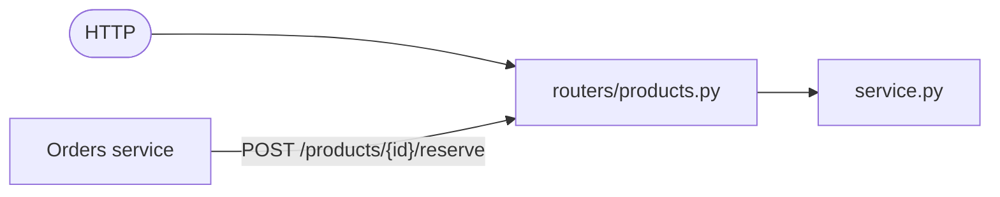
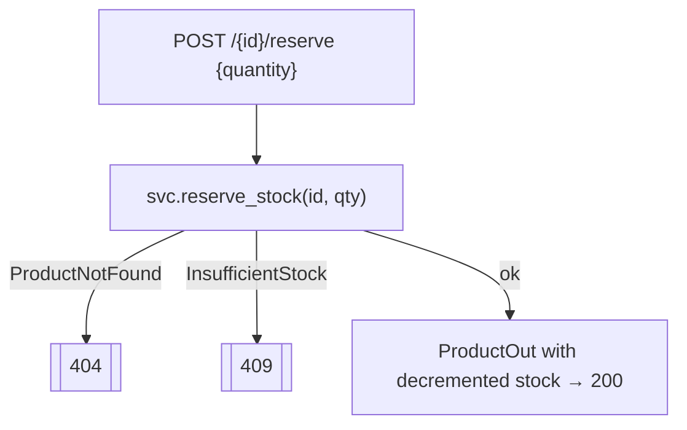

# `services/products/app/routers/` — HTTP endpoints

The transport layer for the catalog. Thin handlers: validate input → delegate to
`ProductService` → map domain exceptions to status codes. The star endpoint is
**`reserve`**, which the Orders service calls at checkout.



| File | Prefix | Purpose |
|------|--------|---------|
| [products.py](products.py) | `/products` | catalog CRUD + stock reservation |
| [health.py](health.py) | `/health` | liveness + readiness (identical pattern to Users) |

---

## 1. `products.py`

Same per-request DI helper as Users:

```python
def _service(session=Depends(get_session)) -> ProductService:
    return ProductService(ProductRepository(session))
```

### Endpoints

| Handler | Route | Success | Error mapping |
|---------|-------|---------|---------------|
| `create_product` | `POST /products` | `201` `ProductOut` | `SkuAlreadyExists` → **409** |
| `get_product` | `GET /products/{id}` | `ProductOut` | `ProductNotFound` → **404** |
| `list_products` | `GET /products?limit&offset` | list | `limit` 1–100, `offset ≥ 0` |
| `reserve_stock` | `POST /products/{id}/reserve` | `ProductOut` (new stock) | `ProductNotFound` → **404**, `InsufficientStock` → **409** |

### The reserve handler line-by-line



```python
@router.post("/{product_id}/reserve", response_model=ProductOut)
async def reserve_stock(product_id, payload: StockReservation, svc=Depends(_service)):
    try:
        product = await svc.reserve_stock(product_id, payload.quantity)
    except ProductNotFound:
        raise HTTPException(404, detail="product not found")
    except InsufficientStock:
        raise HTTPException(409, detail="insufficient stock")
    return ProductOut.model_validate(product)
```

- `StockReservation` guarantees `quantity > 0` before the handler runs.
- Two distinct failures map to two distinct codes so the Orders service can tell
  "no such product" (404) from "not enough stock" (409).

---

## 2. `health.py`

Identical to the Users health router: `/health/live` (process up, no DB) and
`/health/ready` (`SELECT 1`, returns **503** on DB failure). See
[`../../../users/app/routers/README.md`](../../../users/app/routers/README.md) §2.

## 3. `__init__.py`

Empty package marker enabling `from .routers import health, products`.
