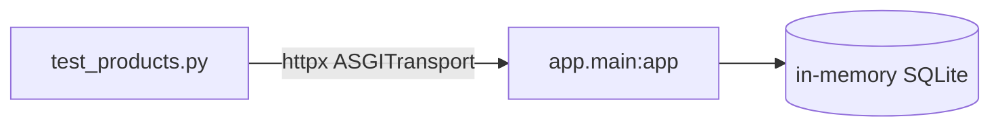
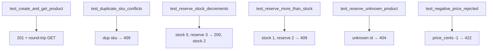

# `services/products/tests/` — test suite

End-to-end HTTP tests over an in-memory SQLite database, same harness as the
Users service ([conftest.py](conftest.py) provides the `client` fixture via
`ASGITransport` — see [`../../users/tests/README.md`](../../users/tests/README.md) §1).



---

## What each test proves



| Test | Asserts | Guards the rule |
|------|---------|-----------------|
| `test_health_live` | `200 {status: alive}` | probe wiring |
| `test_create_and_get_product` | `201`, then `GET` echoes id + stock | create/read path |
| `test_duplicate_sku_conflicts` | second `DUP` sku → **409** | SKU uniqueness |
| `test_reserve_stock_decrements` | reserve 3 of 5 → **200**, `stock == 2` | the core decrement |
| `test_reserve_more_than_stock_conflicts` | reserve 2 of 1 → **409** | oversell protection (`InsufficientStock`) |
| `test_reserve_unknown_product_404` | reserve missing id → **404** | `ProductNotFound` mapping |
| `test_negative_price_rejected_by_validation` | `price_cents=-1` → **422** | boundary validation |

The `_make(client, sku, stock, price)` helper at the top builds a product so each
test starts from a known catalog state.

---

## How to run

```powershell
cd services/products
..\..\.venv\Scripts\python.exe -m pytest -q
```
