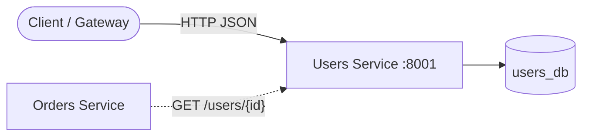
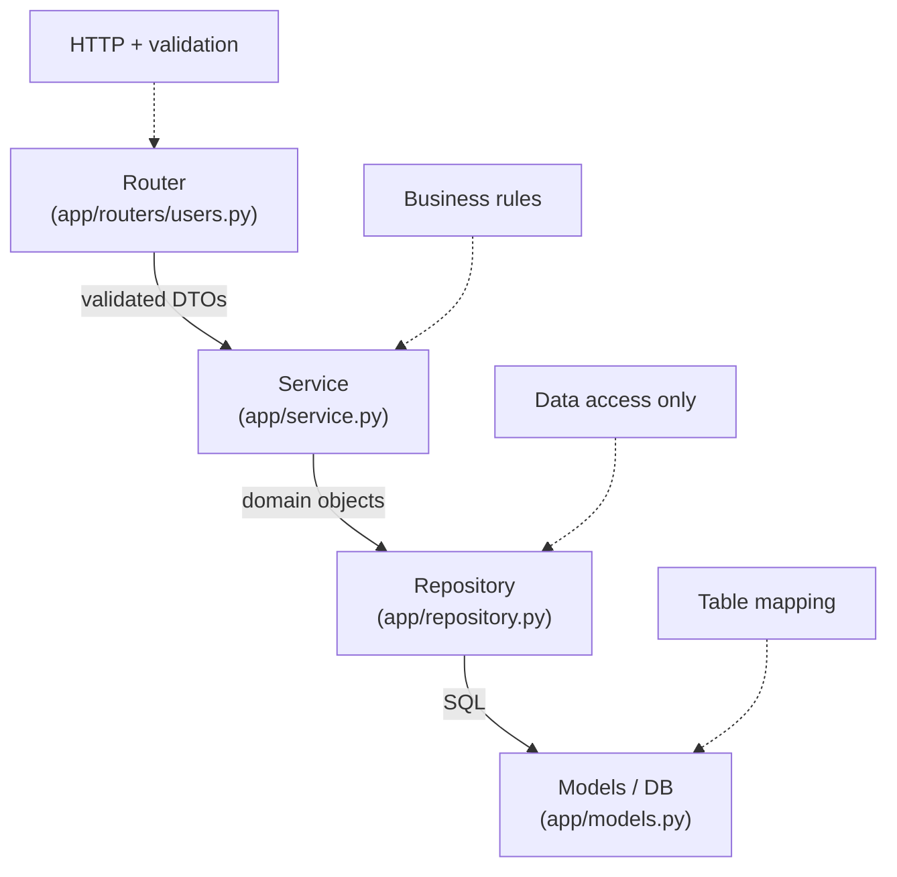
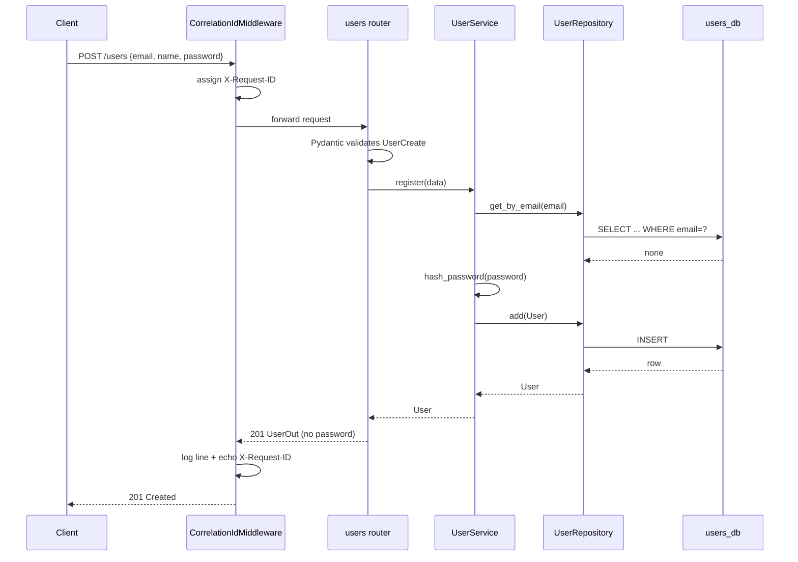

# Users Service

The **Users service** owns everything about accounts: registration, lookup,
listing, and login (issuing JWTs). It is completely self-contained — it has its
own database (`users_db`) and never reaches into another service's tables. Other
services that need to know "is this a real user?" call this service over HTTP.

---

## 1. Where this service sits in the system



- The **Gateway** and the **Orders service** are *clients* of this service.
- The database is private: only this service connects to `users_db`.
- This is the **database-per-service** rule that keeps microservices decoupled.

---

## 2. Layered architecture (how a request flows inside)

Every request passes through the same four layers. Each layer has exactly one
job, which is what makes the code easy to test and change.



| Layer | File | Responsibility | Must NOT do |
|-------|------|----------------|-------------|
| Router | [users.py](app/routers/users.py) | Parse input, map errors to HTTP codes | Business rules, SQL |
| Service | [service.py](app/service.py) | Enforce rules (unique email, auth) | Talk HTTP or raw SQL |
| Repository | [repository.py](app/repository.py) | Run queries | Make decisions |
| Model | [models.py](app/models.py) | Map rows ⇆ objects | Anything else |

---

## 3. Request lifecycle — creating a user



---

## 4. File-by-file explanation

### `app/config.py` — typed settings
Reads configuration from environment variables via **pydantic-settings**.

- `database_url` defaults to `sqlite+aiosqlite:///:memory:` so tests need no
  Postgres; in Docker it is overridden with the real Postgres URL.
- `jwt_secret`, `jwt_algorithm`, `jwt_expire_minutes` control token signing.
- `get_settings()` is wrapped in `@lru_cache` so the object is built **once** and
  reused (settings are effectively a singleton).

### `app/database.py` — async engine + session factory
- `Base` is the declarative base every model inherits from.
- `create_async_engine(...)` — for SQLite in-memory we pass `StaticPool` so all
  connections share the **same** in-memory database (otherwise each connection
  gets a fresh empty DB and tests would see no data).
- `SessionLocal = async_sessionmaker(expire_on_commit=False)` — the factory that
  produces one session per request. `expire_on_commit=False` lets us read the
  object's fields *after* commit without a second query.
- `get_session()` is the FastAPI dependency: it yields a session and guarantees
  it is closed when the request ends (`async with`).
- `init_models()` runs `create_all` at startup (demo convenience; production uses
  Alembic migrations instead).

### `app/models.py` — the table
- `User` maps to the `users` table. `id` is a UUID stored as `String(36)` so the
  *same* code works on both Postgres and SQLite (SQLite has no native UUID).
- `email` is `unique=True, index=True` — the database itself enforces "no two
  accounts with the same email", a guarantee no application check can match.
- `hashed_password` stores the bcrypt hash — **never** the plaintext.

### `app/schemas.py` — the API contract (DTOs)
Pydantic models define exactly what crosses the wire:
- `UserCreate` — input; `email: EmailStr` validates format, `password` has
  `min_length=6`.
- `UserOut` — output; **deliberately has no password field**, so a hash can
  never leak. `from_attributes=True` lets it be built straight from an ORM row.
- `LoginRequest` / `TokenResponse` — login input and the issued token.

### `app/security.py` — hashing + JWT
- `hash_password` / `verify_password` use the `bcrypt` library directly. bcrypt
  is salted and deliberately slow, which resists brute-force attacks. We truncate
  to bcrypt's 72-byte limit explicitly so long inputs never raise.
- `create_access_token` signs a JWT containing `sub` (the user id) and `exp`
  (expiry). The signature lets other services trust the token without calling
  back here.

> ⚠️ **Gotcha we hit:** `passlib==1.7.4` crashes with modern `bcrypt` (5.x)
> because it reads a removed `__about__` attribute. Using `bcrypt` directly
> avoids that entire class of version-shim breakage.

### `app/repository.py` — data access
`UserRepository` is the *only* code that runs queries: `add`, `get`,
`get_by_email`, `list(limit, offset)`. Swapping databases means changing only
this file.

### `app/service.py` — business rules
`UserService` holds the use-cases:
- `register` — rejects duplicate emails (`EmailAlreadyExists`), hashes the
  password, saves.
- `authenticate` — verifies the password and returns a JWT, or raises
  `InvalidCredentials`.

Domain exceptions (not `HTTPException`) live here so the service stays framework
-agnostic and unit-testable.

### `app/routers/users.py` — HTTP endpoints
Thin handlers. The `_service` dependency assembles
`UserService(UserRepository(session))` per request (dependency injection). Each
handler maps a domain exception to a status code:
`EmailAlreadyExists → 409`, `InvalidCredentials → 401`, missing user → `404`.

### `app/routers/health.py` — probes
- `/health/live` — "is the process running?" Never touches the DB. A failure
  here restarts the container.
- `/health/ready` — "can it serve traffic?" Runs `SELECT 1`. A failure here just
  pulls the instance out of the load balancer until the DB recovers.

### `app/observability.py` — tracing every request
- A **correlation id** (`X-Request-ID`) is assigned per request, reused if the
  caller already sent one, so the id follows a request across services.
- It is stored in a `ContextVar` and injected into every JSON log line, so you
  can `grep` one id and see the request's whole journey.

### `app/main.py` — wiring
Builds the `FastAPI` app, adds the correlation middleware, includes the health
and users routers, and (via `lifespan`) creates tables on startup.

---

## 5. Running it

```bash
# from services/users
pip install -r requirements.txt
uvicorn app.main:app --reload --port 8001
# open http://localhost:8001/docs
```

### Try it with curl
```bash
# register
curl -s -X POST localhost:8001/users \
  -H 'Content-Type: application/json' \
  -d '{"email":"ada@example.com","full_name":"Ada Lovelace","password":"s3cret!"}'

# login -> returns a JWT
curl -s -X POST localhost:8001/users/login \
  -H 'Content-Type: application/json' \
  -d '{"email":"ada@example.com","password":"s3cret!"}'
```

### Tests
```bash
pytest -q      # runs against in-memory SQLite, no Postgres needed
```

The suite covers: liveness, create+get, duplicate-email conflict, login
success/failure, and validation rejection of a malformed email.
