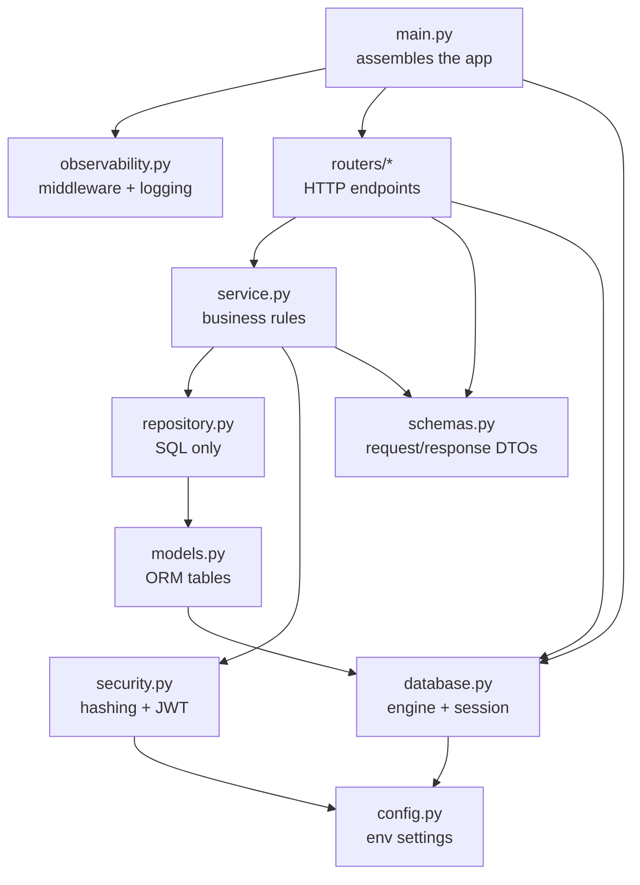
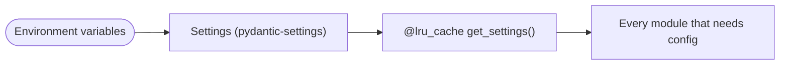
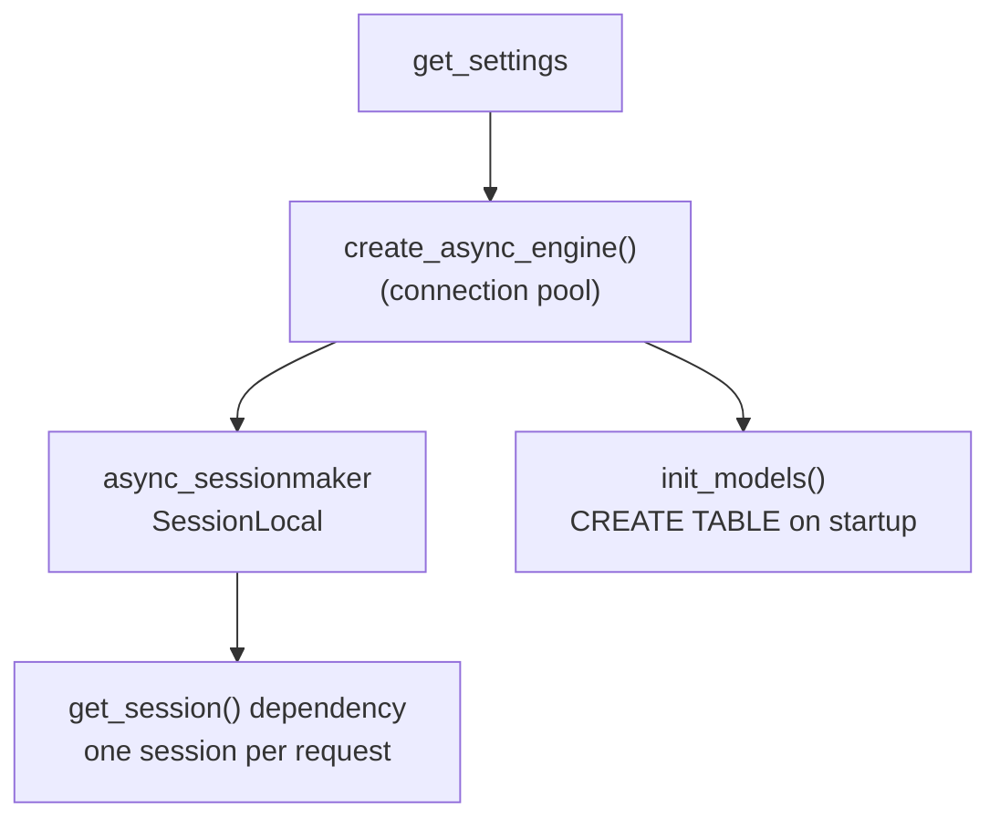
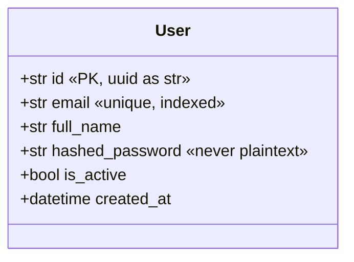
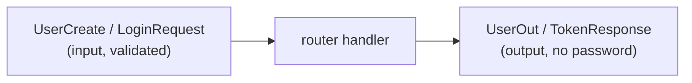
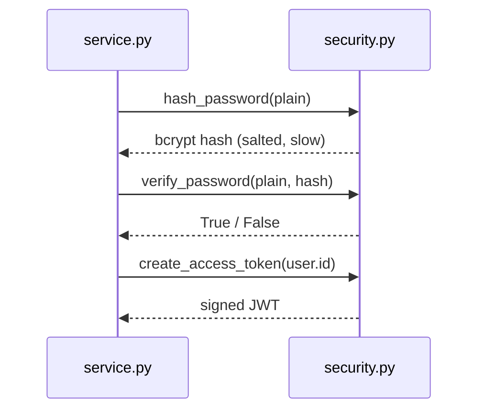
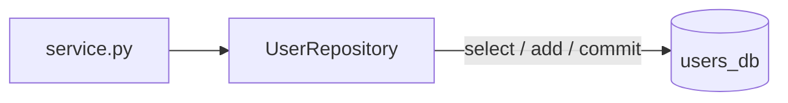
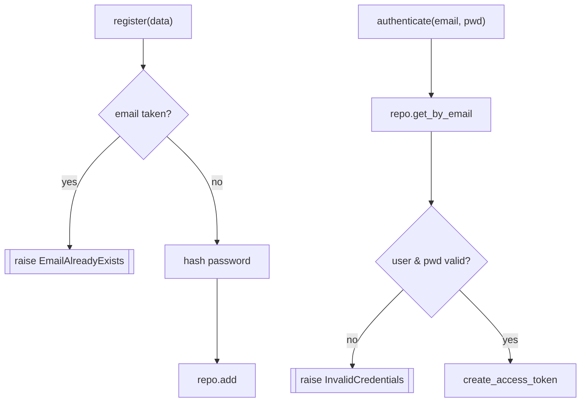
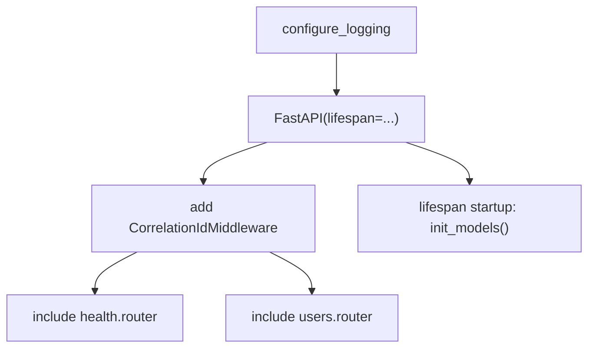
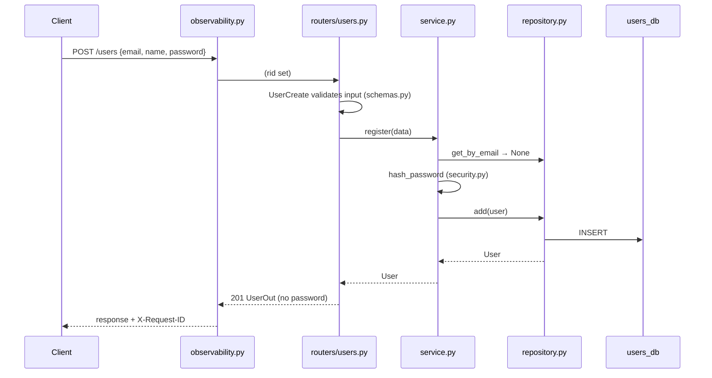

# `services/users/app/` — application package

This folder is the **entire runnable code** of the Users service. Every file here
has exactly one responsibility, arranged as concentric layers so that a request
flows inward (HTTP → rules → data) and a result flows back outward.

> Sub-package [`routers/`](routers/README.md) holds the HTTP endpoints and has its
> own README. This document walks through every module that lives directly in
> `app/`, **line by line**.

> **Concepts in this folder** — see the repo's [CONCEPTS.md](../../../CONCEPTS.md)
> for the full map. This package illustrates *Repository*, *DTO/Mapper*,
> *Singleton*, *Dependency Injection*, *Hashing (DSA)*, and *stateless service*
> (JWT) — each flagged inline below.

---

## 1. How the modules depend on each other



The arrows only ever point **downward/inward** — an inner layer never imports an
outer one. That one rule is what keeps the service testable.

---

## 2. `config.py` — one immutable settings object



| Lines | Code | What it does |
|-------|------|--------------|
| `class Settings(BaseSettings)` | pydantic-settings base | Reads each field from an env var of the same name (case-insensitive). |
| `model_config = SettingsConfigDict(env_file=".env", extra="ignore")` | config | Also load a local `.env` file; silently ignore unknown env vars. |
| `service_name = "users"` | default | Identifies this service in logs. |
| `database_url = "sqlite+aiosqlite:///:memory:"` | default | Runs with **zero infrastructure** by default; docker-compose overrides it with the Postgres URL. |
| `jwt_secret / jwt_algorithm / jwt_expire_minutes` | defaults | Signing key + algorithm + token lifetime for login JWTs. |
| `@lru_cache def get_settings()` | cached factory | Parses the environment **exactly once** per process; every caller shares the same object. |

**Why it matters:** twelve-factor config — the same image runs in dev/stage/prod
with only environment values changing, never code.

> **Pattern — Singleton (cached factory):** `@lru_cache get_settings()` returns
> the same `Settings` instance for the whole process. See
> [03-design-patterns](../../../../../03-design-patterns/architectural_notes.md).

---

## 3. `database.py` — engine, session, table creation



| Lines | Code | What it does |
|-------|------|--------------|
| `class Base(DeclarativeBase)` | ORM base | Every model inherits from it; collects table metadata. |
| `_engine_kwargs = {"echo": False, "future": True}` | engine opts | 2.0-style API, no SQL echo. |
| `if database_url.startswith("sqlite"): … StaticPool` | branch | In-memory SQLite must **share one connection**, otherwise each connection gets a fresh empty database. Only applied for SQLite (tests); Postgres uses the normal pool. |
| `engine = create_async_engine(...)` | pool | One engine (pool) per process. |
| `SessionLocal = async_sessionmaker(engine, expire_on_commit=False)` | factory | `expire_on_commit=False` lets us return ORM objects **after** commit without a second query. |
| `async def get_session()` | dependency | Yields a request-scoped `AsyncSession` inside `async with`, so it is **always closed**, even on error. |
| `async def init_models()` | startup helper | `create_all` for demo convenience; production would use Alembic migrations. |

---

## 4. `models.py` — the `users` table



| Lines | Code | What it does |
|-------|------|--------------|
| `def _uuid(): return str(uuid.uuid4())` | id factory | Generates a random UUID **as a string** so the same model works on Postgres and SQLite without a dialect-specific UUID column. |
| `def _now(): … datetime.now(timezone.utc)` | timestamp factory | Timezone-aware creation time. |
| `id = mapped_column(String(36), primary_key=True, default=_uuid)` | column | 36-char UUID string primary key. |
| `email = mapped_column(String(255), unique=True, index=True)` | column | Uniqueness enforced at the **database** level; indexed for fast login lookups. |
| `hashed_password` | column | Stores only the bcrypt hash — the plaintext never touches the DB. |
| `is_active / created_at` | columns | Soft-enable flag + audit timestamp. |

---

## 5. `schemas.py` — the public wire contract



| Schema | Purpose | Key detail |
|--------|---------|------------|
| `UserCreate` | registration input | `email: EmailStr` validates format; `password: Field(min_length=6)` enforced **at the boundary** before any code runs. |
| `UserOut` | user output | `ConfigDict(from_attributes=True)` allows `model_validate(orm_user)`. **Has no password field** — impossible to leak. |
| `LoginRequest` | login input | email + password. |
| `TokenResponse` | login output | `access_token` + `token_type="bearer"`. |

Keeping schemas separate from `models.py` lets the API contract evolve
independently of the database schema.

> **Pattern — DTO + Mapper:** the Pydantic schemas are Data Transfer Objects; the
> wire shape is decoupled from the ORM model and `model_validate(orm)` maps
> between them. **SOLID — ISP:** separate create/read schemas so callers depend
> only on the fields they use ([02-solid](../../../../../02-solid/architectural_notes.md)).

---

## 6. `security.py` — hashing + tokens



| Lines | Code | What it does |
|-------|------|--------------|
| `_MAX_BCRYPT_BYTES = 72` + `_to_bytes` | truncation | bcrypt only hashes the first 72 bytes; we truncate explicitly so long inputs hash deterministically instead of raising. |
| `hash_password` | `bcrypt.hashpw(..., gensalt())` | Salted + slow hash; different every call. |
| `verify_password` | `bcrypt.checkpw` | Constant-time compare; returns `False` (not an exception) on a malformed stored hash. |
| `create_access_token` | `jwt.encode` | Builds `{"sub": user_id, "exp": now+minutes}` and signs it with the secret. The signature proves integrity so other services can trust the claims. |

**We use the `bcrypt` library directly** — `passlib` 1.7.4 crashes against bcrypt 5.x.

> **DSA — Hashing:** bcrypt is a salted, deliberately-slow one-way hash — the
> canonical hashing use-case. JWT signing is a keyed-hash (HMAC) integrity check.
> See [01-dsa](../../../../../01-dsa/). **System design — stateless auth:** the
> signed token carries identity, so no server-side session is needed.

---

## 7. `repository.py` — the only place that touches SQL



| Method | SQL | Notes |
|--------|-----|-------|
| `add(user)` | `INSERT` + `commit` + `refresh` | Persists and reloads server-generated fields. |
| `get(user_id)` | `session.get(User, id)` | Primary-key fetch, returns `None` if missing. |
| `get_by_email(email)` | `select(...).where(email==)` | Used by register (dup check) and login. |
| `list(limit, offset)` | `select().order_by().limit().offset()` | Deterministic pagination by `created_at`. |

Isolating SQL here keeps the service layer pure and swappable.

> **Pattern — Repository:** all persistence lives behind this collection-like
> interface; the service never sees SQLAlchemy. **SOLID — DIP:** the service
> depends on this abstraction, not on the database
> ([03-design-patterns](../../../../../03-design-patterns/architectural_notes.md)).

---

## 8. `service.py` — business rules



| Method | Rule enforced |
|--------|---------------|
| `register` | Reject duplicate email → `EmailAlreadyExists`; hash password before storing. |
| `get / list` | Straight pass-through to the repository. |
| `authenticate` | Verify email exists **and** password matches; on success mint a JWT, else `InvalidCredentials`. |

Domain exceptions (`EmailAlreadyExists`, `InvalidCredentials`) are defined here and
translated to HTTP codes by the router — the service never imports FastAPI.

> **SOLID — SRP:** this layer holds *only* business rules; transport (router) and
> persistence (repository) are elsewhere. That single-responsibility split is
> what makes each layer unit-testable ([02-solid](../../../../../02-solid/architectural_notes.md)).

---

## 9. `observability.py` — correlation id + JSON logs

```mermaid
sequenceDiagram
    participant C as Client
    participant M as CorrelationIdMiddleware
    participant H as handler
    C->>M: request (maybe with X-Request-ID)
    M->>M: rid = header or new uuid; store in contextvar
    M->>H: call_next(request)
    H-->>M: response
    M->>M: log "METHOD path -> N ms" (rid attached)
    M-->>C: response + X-Request-ID header
```

| Lines | Code | What it does |
|-------|------|--------------|
| `request_id_ctx = ContextVar(...)` | contextvar | Per-request id, readable anywhere without threading it through calls. |
| `_JsonFormatter.format` | logging | Emits each log line as JSON including the current `request_id`. |
| `configure_logging` | setup | Replaces root handlers with the JSON handler at the configured level. |
| `CorrelationIdMiddleware.dispatch` | middleware | Reuses the caller's `X-Request-ID` (or generates one), times the request, logs it, resets the contextvar, and echoes the id back in the response header so it propagates across services. |

---

## 10. `main.py` — assembly



Wiring order: configure logging → create the app with a `lifespan` that creates
tables on startup → add the correlation middleware → include the `health` and
`users` routers → expose a tiny `/` meta endpoint. This is the file `uvicorn`
imports (`app.main:app`).

---

## 11. Putting it together — one end-to-end call



| File | Role in this call |
|------|-------------------|
| [observability.py](observability.py) | assigns request id, logs the request |
| [routers/users.py](routers/users.py) | validates body, maps errors to HTTP |
| [service.py](service.py) | dup-check + hashing rule |
| [security.py](security.py) | bcrypt hash |
| [repository.py](repository.py) | the INSERT |
| [models.py](models.py) | row ⇆ object mapping |
| [schemas.py](schemas.py) | `UserOut` strips the password |
