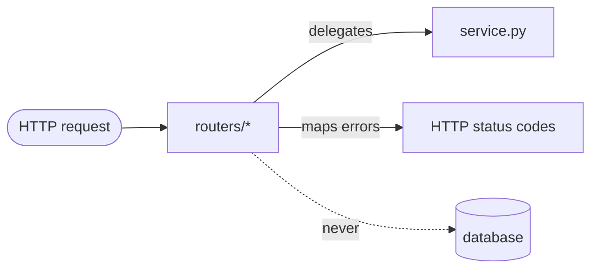
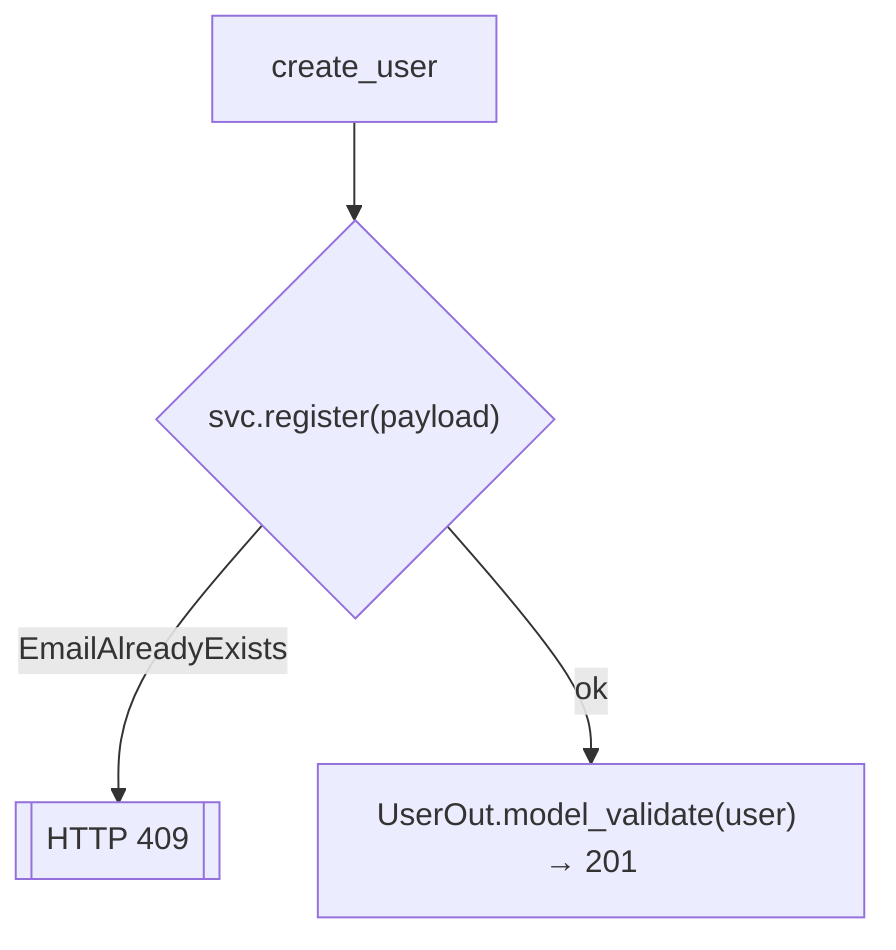
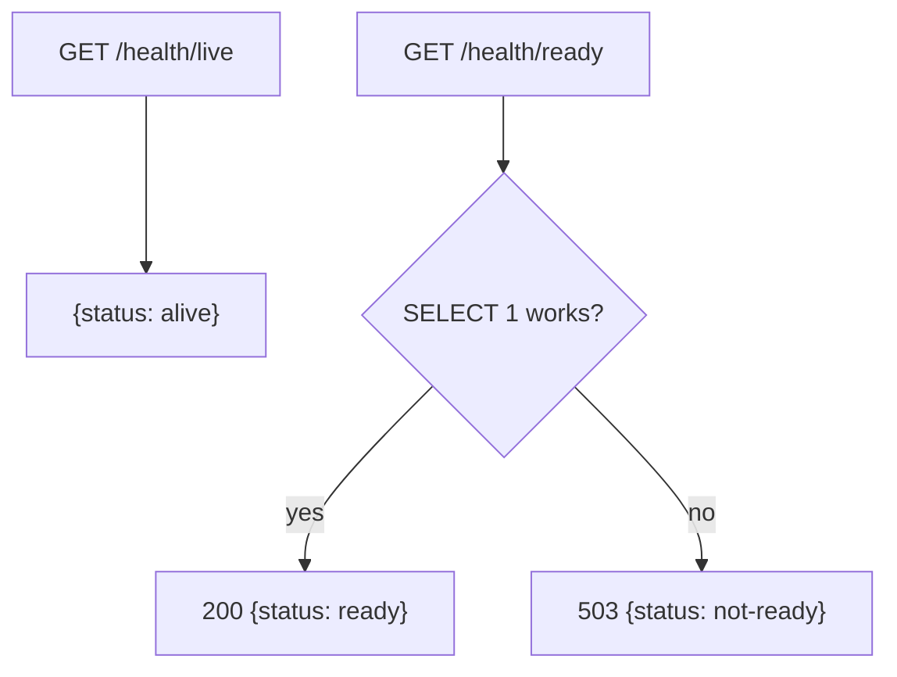

# `services/users/app/routers/` — HTTP endpoints

This sub-package is the **transport layer**: the only place that knows about HTTP.
Handlers here are deliberately *thin* — they parse validated input, delegate to
the service, and translate domain exceptions into status codes. No business rules
and no SQL live here.



Two routers are registered by [`../main.py`](../main.py):

| File | Prefix | Purpose |
|------|--------|---------|
| [users.py](users.py) | `/users` | account CRUD + login |
| [health.py](health.py) | `/health` | liveness + readiness probes |

---

## 1. `users.py` — account & auth endpoints

### The dependency that builds the service per request


```python
def _service(session = Depends(get_session)) -> UserService:
    return UserService(UserRepository(session))
```

FastAPI resolves `get_session` (a fresh DB session), wraps it in a repository,
wraps that in the service, and injects the finished object — **constructor
injection**, one graph per request. Tests override this to inject fakes.

### Endpoint-by-endpoint

| Handler | Route | Success | Error mapping |
|---------|-------|---------|---------------|
| `create_user` | `POST /users` → `201` | returns `UserOut` | `EmailAlreadyExists` → **409** |
| `get_user` | `GET /users/{id}` | returns `UserOut` | missing → **404** |
| `list_users` | `GET /users?limit&offset` | list of `UserOut` | `limit` bounded `1..100`, `offset ≥ 0` via `Query(...)` |
| `login` | `POST /users/login` | returns `TokenResponse` | `InvalidCredentials` → **401** |



Line-by-line of the core handler:

```python
@router.post("", response_model=UserOut, status_code=201)
async def create_user(payload: UserCreate, svc = Depends(_service)):
    try:
        user = await svc.register(payload)   # business rule lives in service
    except EmailAlreadyExists:
        raise HTTPException(409, detail="email already registered")
    return UserOut.model_validate(user)      # ORM → response DTO (no password)
```

- `payload: UserCreate` — FastAPI validates the JSON body **before** the function
  runs; a bad email returns 422 automatically.
- `response_model=UserOut` — guarantees the response is serialized through
  `UserOut`, so a password can never accidentally be returned.
- The `try/except` is the **only** place the domain exception becomes an HTTP code.

---

## 2. `health.py` — liveness vs. readiness



| Endpoint | Touches DB? | Meaning | Orchestrator action on failure |
|----------|-------------|---------|-------------------------------|
| `/health/live` | no | "the process is running" | **restart** the pod |
| `/health/ready` | yes (`SELECT 1`) | "it can serve traffic" | **remove from load balancer** (no restart) |

`ready` runs a trivial `SELECT 1`; any exception sets the response to **503** and
returns `{"status": "not-ready"}` instead of crashing.

---

## 3. `__init__.py`

Empty marker that makes `routers` an importable package, so `main.py` can do
`from .routers import health, users`.
