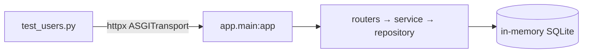
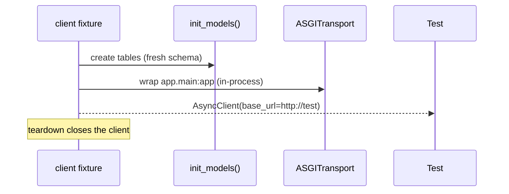
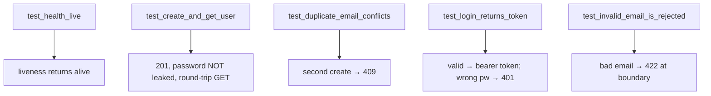

# `services/users/tests/` — test suite

These are **end-to-end HTTP tests** that exercise the real FastAPI app in-process
against an in-memory SQLite database. No Postgres, no network, no mocks of the
internal layers — a request goes in the front door and the assertions check the
JSON that comes out.



| File | Role |
|------|------|
| [conftest.py](conftest.py) | provides the `client` fixture |
| [test_users.py](test_users.py) | the actual test cases |
| `__init__.py` | marks the folder a package |

---

## 1. `conftest.py` — the `client` fixture



```python
@pytest_asyncio.fixture
async def client() -> AsyncClient:
    await init_models()                       # create schema
    transport = ASGITransport(app=app)        # talk to the app with no socket
    async with AsyncClient(transport=transport, base_url="http://test") as c:
        yield c
```

- `ASGITransport` routes httpx requests **straight into the ASGI app** — fast and
  hermetic, no TCP port.
- The app already defaults to `sqlite+aiosqlite:///:memory:`, so the fixture only
  needs to create the schema.
- `asyncio_mode=auto` (in [`../pytest.ini`](../pytest.ini)) lets the tests be
  `async def` without a decorator.

---

## 2. `test_users.py` — what each test proves



| Test | Asserts | Guards against |
|------|---------|----------------|
| `test_health_live` | `200 {status: alive}` | broken probe wiring |
| `test_create_and_get_user` | `201`, then `GET` returns same id; **`password`/`hashed_password` absent** | leaking secrets in responses |
| `test_duplicate_email_conflicts` | second identical create → **409** | broken uniqueness rule |
| `test_login_returns_token` | valid creds → `bearer` token; wrong password → **401** | auth regressions |
| `test_invalid_email_is_rejected_by_validation` | malformed email → **422** | validation bypass at the boundary |

The `test_create_and_get_user` assertion `assert "password" not in body` is the
security regression test — it fails loudly if a future change ever serializes the
hash.

---

## How to run

```powershell
cd services/users
..\..\.venv\Scripts\python.exe -m pytest -q
```
